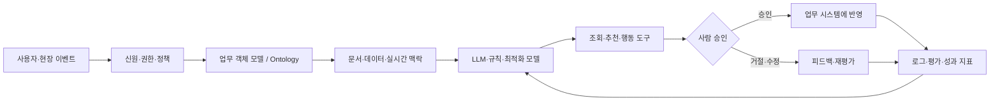

# Palantir AX Playbook

팔란티어가 공개한 Foundry·AIP·Apollo·Ontology와 기업 고객 사례를 바탕으로, 기업이 AI를 실제 업무와 의사결정에 연결하는 방법을 정리한 AI Study 저장소입니다.

## 한 줄 결론

기업 AX의 핵심은 챗봇을 하나 더 만드는 것이 아니라, **업무 객체와 데이터의 의미를 통합하고, AI가 할 수 있는 행동을 권한·검증·감사 가능한 도구로 제한한 뒤, 사람의 승인과 운영 지표를 포함한 업무 루프로 배포하는 것**입니다.

## 이 저장소에서 답하는 질문

- 팔란티어의 AI는 단순한 질의응답과 무엇이 다른가?
- Foundry, Ontology, AIP, Apollo, FDE가 기업 운영에서 어떤 역할을 하는가?
- AI가 추천을 넘어 실제 업무를 변경할 때 어떤 안전장치가 필요한가?
- 우리 회사가 90일 안에 검증 가능한 AX 파일럿을 시작하려면 무엇을 준비해야 하는가?
- 모델 정확도 외에 어떤 평가·운영·변화관리 지표를 봐야 하는가?

## 문서 구성

1. [팔란티어 AI·AX 플레이북](docs/PALANTIR-AI-AX-PLAYBOOK.md) — 구조, 사례, 도입 순서, 기술·조직·거버넌스까지 한 번에 읽는 본문
2. [AX 유스케이스 캔버스](docs/AX-USE-CASE-CANVAS.md) — 후보 업무를 선정하고 파일럿 범위를 정의하는 템플릿
3. [평가 루브릭](docs/EVALUATION-RUBRIC.md) — 답변·추천·행동형 AI를 출시 전에 검증하는 기준과 테스트 케이스 형식
4. [참고자료](docs/REFERENCES.md) — 공식 문서와 고객 사례, 각 자료가 뒷받침하는 주장, 자료의 한계

## 먼저 읽는 법

- **경영진·기획자**: 본문 1~3장 → 6장 90일 로드맵 → 10장 의사결정 게이트
- **개발자·데이터 엔지니어**: 본문 4~8장 → 평가 루브릭 → 캔버스의 데이터·행동 계약
- **보안·법무·감사**: 본문 7장 권한·거버넌스 → 8장 실패 설계 → 참고자료의 근거 범위
- **면접·스터디**: 본문 2장 핵심 구조 → 사례 표 → 마지막 학습 과제

## 근거를 읽는 규칙

문서 안에서 다음 표기를 구분합니다.

- **[공식 사실]**: 팔란티어 공식 제품 문서·공시·공식 고객 사례에 직접 기술된 내용
- **[사례]**: 팔란티어 또는 고객이 공개한 사례. 수치와 성과는 별도 독립 검증이 없으면 `vendor/customer-reported`로 표시
- **[분석]**: 공개 자료를 기업 AX 관점에서 해석한 내용
- **[권고]**: 특정 기업에 그대로 복사하기 위한 명령이 아니라, 이 저장소가 제안하는 실행 원칙

공개 자료만으로 팔란티어 내부의 모든 사내 AI 사용 방식을 확인할 수는 없습니다. 따라서 이 저장소의 표현은 “팔란티어가 기업 고객의 운영에 AI를 연결하는 공개 방식”을 중심으로 하며, 팔란티어 내부 운영을 단정하지 않습니다. 자료 확인 기준일은 **2026-08-14**입니다.

## 핵심 학습 산출물

이 저장소를 읽은 뒤 아래 네 문장을 자신의 조직 업무에 맞게 말할 수 있으면 1차 학습이 끝난 것입니다.

1. “우리 AI가 읽고 판단해야 하는 업무 객체는 무엇이고, 각 객체의 출처·상태·소유자는 무엇인가?”
2. “AI가 할 수 있는 행동과 할 수 없는 행동을 어떻게 권한·스키마·승인으로 제한할 것인가?”
3. “출시 전에 어떤 정상·경계·적대적 테스트를 통과해야 하는가?”
4. “파일럿이 실제 업무 성과를 냈다고 말할 수 있는 비교 기준과 운영 책임자는 누구인가?”

## 라이선스와 사용 범위

이 저장소는 학습·검토용 공개 문서입니다. 팔란티어의 상표·제품명·원문 자료의 권리는 각 권리자에게 있으며, 사례 수치는 원 출처의 조건과 한계를 함께 확인해야 합니다.
