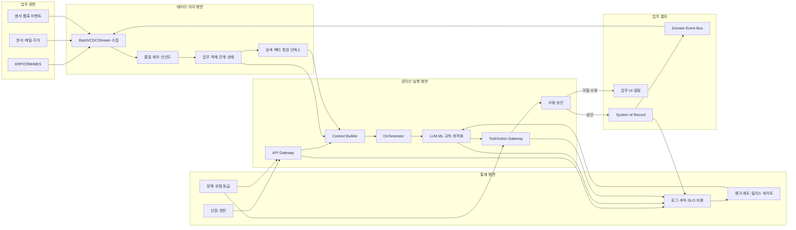
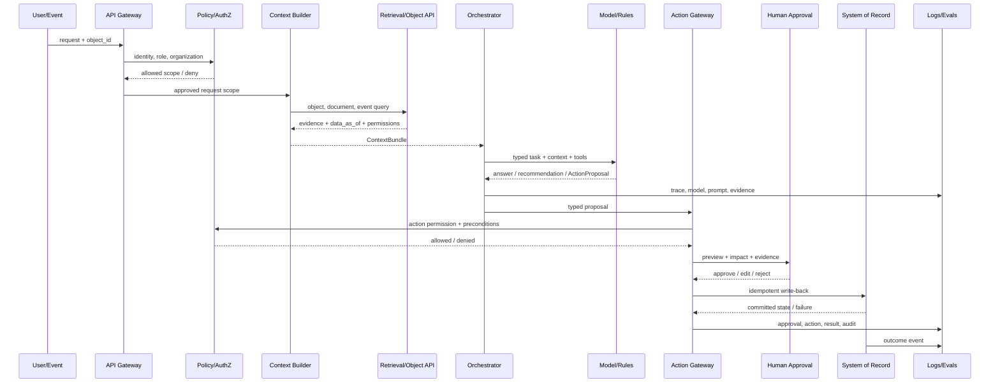
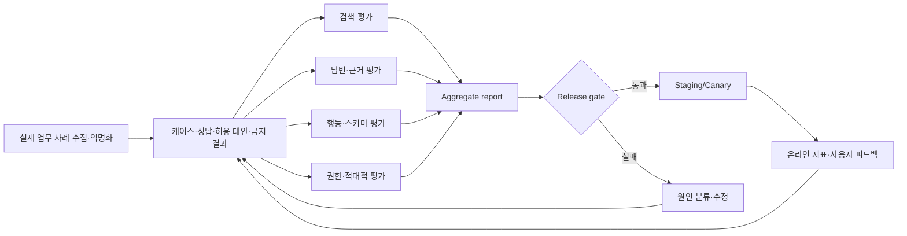
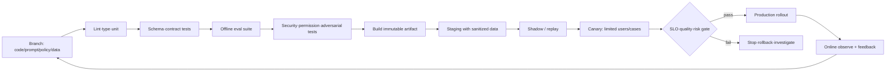

# AX 기술 파이프라인·시스템 설계

> AX를 실제로 구축할 때 필요한 데이터 파이프라인, 온라인 AI 실행 파이프라인, 평가·배포 파이프라인, 서비스 경계와 운영 설계를 구현 순서대로 정리한 문서입니다.

이 문서는 “어떤 모델을 쓸까?”보다 먼저 **어떤 데이터가 들어와 어떤 업무 판단을 거쳐 어떤 시스템 상태를 바꾸고, 그 결과를 어떻게 평가·감사·되돌릴 것인가**를 설계하는 데 초점을 둡니다.

- 관련 문서: [AX 전환 가이드](AX-TRANSFORMATION-GUIDE.md), [AX 프로그램 캔버스](AX-PROGRAM-CANVAS.md), [AI 평가 루브릭](EVALUATION-RUBRIC.md)
- 대상: AX 아키텍트, 데이터·AI·백엔드 개발자, 플랫폼/SRE, 보안·감사 담당자
- 설계 범위: 배치·이벤트·온라인 요청·사람 승인·업무 시스템 반영·운영 피드백
- 원칙: 벤더 중립적 논리 설계. Palantir의 Ontology·AIP·Actions 개념은 참고 패턴으로만 사용

## 1. 30초 요약

실제 AX 시스템은 한 개의 LLM API가 아니라 다음 다섯 파이프라인이 서로 연결된 시스템입니다.

```text
1. Data/semantic pipeline
   원천 시스템 → 수집 → 품질·계보 → 업무 객체·상태 → 검색·특징·인덱스

2. Online decision pipeline
   사용자/이벤트 → 신원·권한 → 맥락 조립 → 모델·규칙 → 추천/행동 계획

3. Action pipeline
   행동 계획 → 스키마·정책 검증 → 사람 승인 → idempotent write-back → 이벤트 발행

4. Evaluation pipeline
   실제 케이스 → 고정 평가 세트 → 검색·답변·행동·권한 평가 → 릴리스 게이트

5. Delivery/operations pipeline
   코드·프롬프트·정책 변경 → CI → 스테이징 → 카나리 → 관찰성 → 롤백·재평가
```

### 1.1 전체 상호작용 흐름



이 흐름에서 데이터 평면은 “무엇이 사실인가”를 준비하고, 실행 평면은 “지금 무엇을 할 것인가”를 결정하며, 통제 평면은 “누가 어떤 근거로 무엇을 했는가”를 제한·기록합니다. 세 평면을 한 서비스나 한 프롬프트에 몰아넣지 않는 것이 핵심입니다.

## 2. 먼저 고정할 설계 결정

구현 전에 아래 결정을 문서로 고정해야 합니다. 이 결정이 없으면 개발 중에 파이프라인이 계속 바뀝니다.

| 결정 | 반드시 답할 질문 | 예시 결과 |
|---|---|---|
| 업무 경계 | 어느 업무의 어떤 상태를 바꾸는가? | `PurchaseOrder.DELAYED` 예외 처리 |
| 처리 모드 | 배치·이벤트·온라인 요청 중 무엇인가? | 지연 이벤트는 실시간, 주간 재계획은 배치 |
| 데이터 기준 | 어떤 시점의 값을 사실로 볼 것인가? | `data_as_of`, source priority, freshness SLA |
| 의미 모델 | 시스템 간 같은 대상을 어떻게 연결하는가? | Order·Supplier·Material 객체와 관계 |
| 권한 경계 | 사용자·조직·객체·필드·행동 권한은? | 조직별 주문 조회, 승인 금액 한도 |
| AI 역할 | 생성·검색·예측·분류·최적화 중 무엇인가? | LLM 설명 + 규칙 판정 + 최적화 대안 |
| 행동 경계 | AI가 읽기·추천·초안·실행 중 어디까지 하는가? | `create_review_task`만 실행 가능 |
| 사람 개입 | 언제 승인·수정·거절·이관하는가? | 금액 초과·근거 충돌 시 승인 필수 |
| 평가 단위 | 답변·필드·추천·행동·업무 성과 중 무엇을 평가하는가? | 6종 평가 케이스 |
| 복구 | 실패·중복·부분 성공을 어떻게 되돌리는가? | idempotency key + compensating action |
| 운영 | 누가 비용·지연·모델 변경·사고를 담당하는가? | AX on-call와 서비스 오너 |

## 3. 파이프라인 A — 데이터·업무 의미 파이프라인

### 3.1 데이터 흐름의 표준 단계

```text
Source inventory
  → Ingestion
  → Raw immutable storage
  → Validation & quality
  → Curated domain data
  → Semantic object/state model
  → Search/vector/feature projections
  → Context-serving API
```

### 3.2 단계별 설계

| 단계 | 입력 | 처리 | 결과 | 실패 시 |
|---|---|---|---|---|
| Source inventory | 시스템·문서·이벤트 목록 | 소유자·스키마·민감도·갱신주기 등록 | 데이터 카탈로그 | 승인 전 사용 금지 |
| Ingestion | DB, API, 파일, CDC, 이벤트 | 배치·증분·스트림 수집, 재시도 | 원천 이벤트·파일 | 격리 큐·재처리 |
| Raw storage | 원천 payload | 변경하지 않고 버전·수집시각 저장 | 재현 가능한 원본 | 알림·원천별 backfill |
| Validation | raw 데이터 | 스키마·필수값·유일성·범위·참조 검증 | 품질 결과·격리 데이터 | downstream 차단 |
| Curated data | 검증 통과 데이터 | 타입 통일·중복 제거·조인·정규화 | 도메인 데이터셋 | 품질 기준 미달 표시 |
| Semantic model | 도메인 데이터 | 객체·관계·상태·행동·소유자 연결 | 업무 객체 API | 의미 모델 변경 심사 |
| Projections | 객체·문서·이벤트 | 텍스트 청킹·임베딩·검색·특징 생성 | 인덱스·특징 | 해당 source 제외·경고 |
| Context API | 사용자 요청·객체 ID | 권한·신선도·필터·근거 묶음 생성 | Context Bundle | 불확실성·추가 질문 |

### 3.3 배치·CDC·스트림 선택

| 방식 | 적합한 업무 | 장점 | 비용·주의 |
|---|---|---|---|
| 배치 | 일일 마감, 주간 계획, 대규모 재계산 | 단순·저렴·재현성 | 최신 상태가 늦음 |
| CDC | 주문·재고·고객 상태 변경 | 원천 변경을 증분 반영 | 순서·중복·스키마 변경 |
| 이벤트 스트림 | 장애·센서·실시간 알림 | 낮은 지연·반응형 업무 | 운영 복잡도·순서·재처리 |
| 요청 시 조회 | 최신 잔액·권한·상태 확인 | 가장 최신 값 | 지연·원천 시스템 부하 |

혼합형이 일반적입니다. 예를 들어 주문 객체는 CDC로 유지하고, 계약서는 배치로 인덱싱하며, 고객 요청 직전에 승인 상태와 금액을 원천 시스템에서 재확인합니다.

### 3.4 품질·신선도 게이트

AI에 데이터를 전달하기 전에 적어도 다음 규칙을 실행합니다.

```yaml
dataset: purchase_orders
checks:
  - name: schema_compatibility
    severity: block
  - name: order_id_unique
    severity: block
  - name: active_order_due_date_not_null
    severity: block
  - name: supplier_reference_exists
    severity: warn
  - name: freshness_under_15_minutes
    severity: block_for_action
on_failure:
  block_actions: true
  allow_read_with_warning: true
  notify: procurement-data-owner
evidence:
  - rule_version
  - checked_at
  - failed_rows_count
  - source_snapshot_id
```

`warn`과 `block`을 구분해야 합니다. 신선도 문제가 있어도 과거 상태를 조회할 수는 있지만, 고위험 행동은 실행하지 않는 식으로 읽기와 쓰기의 위험을 다르게 처리합니다.

### 3.5 업무 객체 모델

테이블을 그대로 LLM에 전달하지 말고, AI와 사람이 함께 사용할 업무 객체를 정의합니다.

```yaml
object_type: PurchaseOrder
identity: purchase_order_id
properties:
  - name: status
    type: enum
    values: [OPEN, DELAYED, APPROVAL_PENDING, APPROVED, CLOSED]
  - name: due_date
    type: date
  - name: total_amount
    type: money
links:
  - relation: supplied_by
    target: Supplier
  - relation: contains
    target: Material
actions:
  - create_review_task
  - submit_for_approval
  - approve_change
owners: [procurement-team]
permissions:
  view: object_and_organization_scoped
  edit: action_only
```

객체 모델의 목적은 데이터를 예쁘게 이름 짓는 것이 아닙니다. 동일한 대상의 상태·권한·근거·행동·감사를 한 경계 안에 모으는 것입니다.

## 4. 파이프라인 B — 온라인 AI 의사결정 파이프라인

### 4.1 요청부터 응답·행동까지



### 4.2 서비스 경계

| 서비스 | 책임 | 가져도 되는 권한 | 가지면 안 되는 책임 |
|---|---|---|---|
| API Gateway | 요청 인증·속도 제한·request ID | 사용자 인증 토큰 검증 | 모델 호출·업무 DB 직접 수정 |
| Policy/AuthZ | 사용자·조직·객체·필드·행동 권한 | 정책 조회·결정 | 자연어 해석·권한을 프롬프트로만 전달 |
| Context Builder | 요청에 필요한 근거와 상태 묶기 | 허용된 조회 API 호출 | 권한 우회·근거 없는 데이터 추가 |
| Retrieval/Object API | 업무 객체·문서·이벤트 검색 | 읽기 권한 | 쓰기·승인 |
| Orchestrator | 단계·도구·재시도·상태 조정 | allowlisted tool 호출 | 직접 DB write·무제한 루프 |
| Model Service | LLM·ML·규칙·최적화 실행 | 모델 추론 | 권한 판정·직접 side effect |
| Action Gateway | 행동 스키마·사전조건·idempotency·승인 | 검증된 action 호출 | 자유 SQL·무제한 외부 호출 |
| Approval Service | 사람 검토·승인·수정·거절 | 승인 상태 기록 | 모델 결과를 승인으로 위조 |
| Write-back Adapter | 업무 시스템에 상태 반영 | 목적별 최소 쓰기 권한 | 임의 테이블 수정·승인 생략 |
| Observability | 로그·추적·비용·지연·품질 | 메타데이터·마스킹된 payload | 원문 비밀값 무제한 저장 |
| Evaluation Service | 고정 케이스·회귀·릴리스 판정 | 테스트 데이터·결과 | 운영 데이터를 무단 학습 데이터로 전환 |

서비스를 많이 쪼개는 것이 목표는 아닙니다. 핵심은 **권한 판정·모델 추론·행동 실행·감사**를 한 함수에 섞지 않는 것입니다. 작은 팀은 모듈로 시작하되 이 경계를 API·인터페이스로 유지할 수 있습니다.

### 4.3 Context Bundle

모델에 전달되는 컨텍스트는 문자열 하나가 아니라 구조화된 객체로 관리합니다.

```json
{
  "request_id": "req-2026-0001",
  "actor": {
    "user_id": "user-77",
    "role": "buyer",
    "organization": "asia-procurement"
  },
  "task": "supply_delay_triage",
  "data_as_of": "2026-08-14T09:00:00+09:00",
  "objects": [
    {
      "type": "PurchaseOrder",
      "id": "po-123",
      "state": "DELAYED",
      "visible_properties": ["due_date", "supplier_id", "total_amount"]
    }
  ],
  "evidence": [
    {"id": "erp:po-123", "source": "ERP", "kind": "structured"},
    {"id": "doc:contract-77", "source": "contract-index", "kind": "document"}
  ],
  "allowed_tools": ["create_review_task"],
  "prohibited_tools": ["approve_purchase_order", "delete_purchase_order"],
  "policy_version": "policy-2026-08-14"
}
```

모델은 `allowed_tools`만 볼 수 있어야 하고, 실제 권한·사전조건은 Action Gateway가 다시 검사해야 합니다. 프롬프트에 “이 도구만 사용하라”고 쓰는 것은 서버측 보안 통제가 아닙니다.

## 5. 파이프라인 C — 행동·write-back 설계

### 5.1 ActionProposal과 실행 분리

모델의 출력과 실제 실행 요청을 분리합니다.

```json
{
  "proposal_id": "proposal-9001",
  "action_type": "create_review_task",
  "target": {
    "object_type": "PurchaseOrder",
    "object_id": "po-123",
    "object_version": "v18"
  },
  "arguments": {
    "assignee": "procurement-exception-team",
    "reason_code": "SUPPLIER_DELAY"
  },
  "evidence_ids": ["erp:po-123", "doc:contract-77"],
  "impact_preview": {
    "writes": ["review_task"],
    "notifications": ["internal_only"],
    "external_side_effect": false
  },
  "requires_approval": true,
  "idempotency_key": "po-123:create_review_task:v18",
  "expires_at": "2026-08-14T10:00:00+09:00"
}
```

### 5.2 Action Gateway 검증 순서

```text
1. request_id·actor·proposal 서명 확인
2. action_type allowlist 확인
3. 대상 객체가 현재 버전과 같은지 확인
4. actor가 대상 객체·행동을 수행할 권한인지 확인
5. 입력 타입·범위·필수값 검증
6. 업무 사전조건·금액·건수·속도 한도 확인
7. 사람 승인 상태와 승인자가 적합한지 확인
8. idempotency key로 중복 실행 방지
9. 업무 시스템에 write-back
10. 결과·새 상태·감사 이벤트 기록
11. 실패 시 재시도 또는 보상 행동 실행
```

### 5.3 트랜잭션과 보상 행동

여러 시스템을 한 번에 바꾸는 업무는 분산 트랜잭션이 어려울 수 있습니다. 다음처럼 상태를 명시합니다.

```text
PROPOSED
  → APPROVAL_PENDING
  → APPROVED
  → EXECUTING
  → COMMITTED

실패 경로:
  EXECUTING → RETRYABLE_FAILURE → RETRYING
  EXECUTING → COMPENSATION_REQUIRED → COMPENSATED
  어느 상태에서든 → REJECTED / EXPIRED / CANCELLED
```

“성공” 응답을 보내기 전에 원천 시스템의 커밋 결과를 확인해야 합니다. 알림만 성공하고 ERP 반영이 실패한 경우처럼 부분 성공이 생기면 운영자가 상태를 복구할 수 있어야 합니다.

## 6. 파이프라인 D — 평가·검증·LLMOps

### 6.1 평가 파이프라인



### 6.2 평가 순서

| 순서 | 평가 | 예시 지표 | 합격 조건 예시 |
|---:|---|---|---|
| 1 | 스키마 | 필수 필드·enum·타입 | 100% |
| 2 | 검색 | recall@k, 근거 포함률 | 업무별 기준 이상 |
| 3 | 사실·근거 | supported claim 비율 | 업무별 기준 이상 |
| 4 | 답변 | 정확성·완전성·거절 | SME 평가 통과 |
| 5 | 행동 | target·argument·precondition | 치명 오류 0 |
| 6 | 권한 | 노출·우회·도구 호출 | 누출 0, 차단 100% |
| 7 | 운영 | P95, 오류, 비용, 재시도 | SLO 통과 |
| 8 | 업무 가치 | 시간·재작업·품질·채택 | 기준선 대비 개선 |

모델이 답변을 잘했다는 것과 업무 행동을 안전하게 실행했다는 것은 다른 평가입니다. 행동형 AI는 답변 점수가 높아도 행동 평가가 실패하면 출시하지 않습니다.

### 6.3 회귀 세트 구성

최소 세트:

- 정상 케이스: 자주 발생하는 대표 업무
- 경계 케이스: 필드 누락·오래된 데이터·충돌하는 근거
- 권한 케이스: 다른 조직·민감 필드·승인자 아닌 사용자
- 적대적 케이스: 프롬프트 인젝션·도구 인자 조작
- 실패 케이스: 검색 장애·원천 timeout·중복 요청·부분 성공
- 회귀 케이스: 모델·프롬프트·정책·데이터 버전 변경 전 기존 기능

## 7. 파이프라인 E — CI/CD·모델·프롬프트 배포

### 7.1 변경 대상은 코드만이 아니다

AX 시스템의 배포 단위에는 다음이 모두 들어갑니다.

```text
애플리케이션 코드
데이터 스키마·변환
업무 객체·상태·행동 계약
프롬프트·tool description
검색·청킹·임베딩 설정
모델 버전·파라미터
정책·권한·승인 규칙
평가 세트·임계값
대시보드·알림·runbook
```

이 중 하나만 바뀌어도 평가·승인·감사 영향이 생길 수 있으므로 Git 또는 동등한 변경관리 시스템에서 버전을 관리합니다.

### 7.2 권장 릴리스 흐름



### 7.3 환경 분리

| 환경 | 데이터 | 실행 권한 | 목적 |
|---|---|---|---|
| Local/dev | synthetic·샘플 | 외부 side effect 없음 | 빠른 개발·단위 테스트 |
| CI | 고정 평가 세트 | mock/stub | 계약·회귀·보안 자동 검사 |
| Staging | 마스킹·재현 데이터 | sandbox write | 통합·성능·승인 흐름 |
| Shadow | 실제 요청 복제, 결과만 비교 | write 금지 | 온라인 분포·모델 비교 |
| Canary | 제한된 사용자·객체·비율 | 제한된 행동 | 실제 품질·채택·비용 검증 |
| Production | 승인된 업무 데이터 | 정책에 따른 최소 권한 | 운영·감사·성과 |

`dev`에서 정상 동작했다는 사실은 `production`에서 안전하게 실행된다는 증거가 아닙니다. 특히 실제 write-back은 sandbox·shadow·canary를 거쳐야 합니다.

### 7.4 롤백 전략

- 코드 롤백: 이전 애플리케이션 artifact로 전환
- 모델 롤백: 이전 승인 모델·프롬프트·검색 설정 묶음으로 복귀
- 정책 롤백: 이전 정책 버전 복귀, 단 보안 취약 정책으로 되돌리지 않음
- 데이터 롤백: 원천 데이터 삭제가 아니라 projection·index를 재생성
- 업무 상태 롤백: 보상 행동·수동 복구 runbook 실행
- 기능 롤백: 행동 권한을 읽기·추천 단계로 즉시 축소

## 8. 파이프라인 F — 관찰성·피드백·지속 운영

### 8.1 로그 스키마

```json
{
  "trace_id": "trace-1",
  "request_id": "req-1",
  "use_case": "supply_delay_triage",
  "actor_hash": "masked-user",
  "policy_version": "policy-v4",
  "context_version": "context-v2",
  "retrieved_evidence_ids": ["erp:po-123"],
  "model_version": "model-v7",
  "prompt_version": "prompt-v9",
  "tool_calls": ["create_review_task"],
  "approval": {"required": true, "decision": "approved"},
  "result": "committed",
  "latency_ms": 2400,
  "token_usage": {"input": 1100, "output": 220},
  "cost": 0.012,
  "data_as_of": "2026-08-14T09:00:00+09:00",
  "error_code": null
}
```

원문 프롬프트·문서·개인정보를 무조건 저장하지 않습니다. 필요한 추적성과 개인정보·영업비밀·보존 정책을 함께 설계합니다.

### 8.2 운영 대시보드

| 관찰 영역 | 핵심 지표 | 경보 예시 | 대응 |
|---|---|---|---|
| 데이터 | freshness, 품질 실패, 지연 | source SLA 초과 | downstream 행동 차단·backfill |
| 검색 | empty result, recall proxy, 근거 부족 | 근거 부족률 급증 | 인덱스·권한·문서 품질 점검 |
| 모델 | 오류·거절·불확실·토큰 | 특정 버전 오류 급증 | canary 중지·모델 롤백 |
| 행동 | 승인·거절·중복·실패 | 중복 side effect | action disable·수동 복구 |
| 운영 | P50/P95, availability, cost | 예산·SLO 초과 | rate limit·모델 라우팅·확장 |
| 업무 | 처리 시간·재작업·품질 | 기준선보다 악화 | 기능 축소·업무 재설계 |
| 채택 | 첫 성공·재사용·수정·우회 | 반복 사용 급락 | UX·교육·근거·업무 흐름 개선 |

### 8.3 피드백 분류

사용자 피드백을 “좋아요/싫어요”로 끝내지 말고 원인으로 분류합니다.

```text
wrong_source       → 데이터·검색
stale_data         → 신선도·수집
wrong_reasoning    → 모델·규칙·컨텍스트
missing_context    → Context Builder
wrong_action       → 행동 계약·검증
not_trustworthy    → 근거·설명·UX
too_slow/expensive → 모델·캐시·범위
workflow_mismatch  → 업무 재설계·변화관리
```

## 9. 저장소·모듈 구조 예시

실제 구현 저장소는 회사의 언어·배포 방식에 맞춰 바꾸되, 책임 경계는 유지하는 것이 좋습니다.

```text
ax-use-case/
├─ app/
│  ├─ api/                 # request/response, auth context
│  ├─ context/             # Context Builder, retrieval orchestration
│  ├─ agents/              # task orchestration, tool selection
│  ├─ actions/             # typed actions, preconditions, idempotency
│  ├─ approvals/           # human approval state machine
│  └─ adapters/            # ERP/CRM/DB/external APIs
├─ domain/
│  ├─ objects/             # business object/state definitions
│  ├─ policies/            # permission/risk/action policies
│  └─ contracts/           # schemas and event contracts
├─ pipelines/
│  ├─ ingestion/           # batch, CDC, stream jobs
│  ├─ quality/             # data checks and quarantine
│  ├─ semantic/            # object projections, index builders
│  └─ backfill/            # replay and recovery
├─ prompts/
│  ├─ tasks/               # versioned prompts and tool descriptions
│  └─ redteam/             # injection and boundary cases
├─ evals/
│  ├─ datasets/            # anonymized test cases
│  ├─ graders/             # rule/LLM/SME graders
│  ├─ regression/          # release gates
│  └─ reports/             # immutable run artifacts
├─ infra/
│  ├─ environments/        # dev/staging/prod configuration
│  ├─ dashboards/          # SLO/cost/quality dashboards
│  └─ runbooks/            # incident, rollback, manual fallback
└─ docs/
   ├─ decision-records/    # architecture/policy decisions
   ├─ data-contracts/      # source and semantic contracts
   └─ threat-models/       # risk and abuse cases
```

구조가 커지기 전에는 하나의 서비스 안에서 모듈로 구현해도 됩니다. 다만 `actions`가 `model` 내부에 들어가거나 `policies`가 프롬프트 텍스트에만 존재하는 구조는 피합니다.

## 10. 구현 순서

### Phase 1 — 읽기 전용 수직 슬라이스

```text
하나의 원천 시스템
 → 하나의 업무 객체
 → 하나의 검색·조회 API
 → 하나의 모델 작업
 → 출처가 있는 답변
 → trace/log
```

완료 기준:

- 사용자 권한으로 조회된다.
- 기준 시각과 출처가 보인다.
- 데이터가 없거나 오래되면 답변을 제한한다.
- 모델 응답과 검색 근거를 추적할 수 있다.

### Phase 2 — 추천과 평가

```text
실제 과거 케이스
 → 익명화·정답·허용 대안
 → 검색·답변·거절 평가
 → 현업 SME 판정
 → 회귀 세트 고정
```

완료 기준:

- 정상·경계·권한·적대적·실패 케이스가 있다.
- 모델을 바꿔도 같은 세트로 비교된다.
- AI가 모르는 상황에서 질문·거절·이관한다.

### Phase 3 — 행동 초안과 승인

```text
추천
 → 구조화 ActionProposal
 → schema/precondition/policy 검증
 → 영향 미리보기
 → 사람 승인·수정·거절
 → sandbox 또는 내부 태스크 write-back
```

완료 기준:

- 모델이 자유 SQL·임의 API를 직접 호출하지 않는다.
- 승인 전에는 업무 원장이 바뀌지 않는다.
- 중복 요청·만료·부분 실패를 처리한다.

### Phase 4 — 제한 실행과 운영

```text
승인된 저위험 행동
 → action gateway
 → idempotent adapter
 → system of record
 → domain event
 → 결과·성과·피드백
```

완료 기준:

- 운영 SLO·비용·품질·권한·중단 지표가 보인다.
- on-call·수동 fallback·롤백이 문서와 훈련으로 존재한다.
- 실제 업무 KPI가 기준선과 비교된다.

### Phase 5 — 여러 업무로 확장

공통화할 것:

- 인증·권한·감사
- 객체·이벤트·데이터 계약 템플릿
- 검색·Context Builder 인터페이스
- Action Gateway·승인·idempotency
- 평가·릴리스·관찰성·비용

도메인에 남길 것:

- 업무 규칙·예외·임계값
- 객체 의미와 상태 전이
- 승인자·책임자·성과 지표
- 실제 사용자 경험과 변화관리

## 11. 설계 대안과 선택 기준

### 중앙 오케스트레이터 vs 이벤트 기반 분산

| 선택 | 장점 | 단점 | 선택 기준 |
|---|---|---|---|
| 중앙 오케스트레이터 | 흐름 추적·승인·재시도 쉬움 | 병목·단일 장애점 | 한 업무의 다단계 agent workflow |
| 이벤트 기반 분산 | 확장·느슨한 결합·실시간 | 순서·중복·추적 어려움 | 독립적인 도메인 이벤트·대량 처리 |
| 혼합 | 요청은 중앙, 장기 처리는 이벤트 | 설계·운영 복잡 | 대부분의 기업 AX |

### RAG vs 구조화 조회 vs 모델·최적화

| 문제 | 우선 선택 | 이유 |
|---|---|---|
| 현재 상태·합계·권한 | 구조화 API/SQL | 정확성·재현성 |
| 유사 문서·정비 기록 | 검색/RAG | 비정형 근거 탐색 |
| 숫자·정책 판정 | 결정론적 규칙·계산기 | LLM의 산술·일관성 한계 |
| 자원 배분·대안 최적화 | 최적화·시뮬레이션 | 목적함수·제약조건 명시 |
| 설명·질문·초안 | LLM | 자연어 처리·요약 |

LLM을 모든 경로의 중심에 두는 대신, 문제에 맞는 엔진을 조합하고 LLM은 근거·도구·행동 경계 안에서 사용합니다.

## 12. 운영 준비도 게이트

| 게이트 | 질문 | 최소 통과 증거 |
|---|---|---|
| Data ready | 데이터가 최신·품질·권한 기준을 만족하는가? | 품질 run·source snapshot·소유자 |
| Semantic ready | 대상·상태·관계·행동이 정의됐는가? | object/state/action contract |
| Model ready | 정상·경계·거절 성능이 기준을 넘는가? | eval report·model/prompt version |
| Security ready | 권한·민감정보·도구가 제한됐는가? | permission/red-team 결과 |
| Action ready | 실행·중복·부분 실패·롤백이 가능한가? | sandbox smoke·idempotency test |
| Human ready | 승인자·교육·이관·수동 fallback이 있는가? | runbook·교육·승인 기록 |
| Operable | 비용·지연·오류·감사가 보이는가? | dashboard·alert·on-call |
| Valuable | 기준선보다 실제 업무가 좋아졌는가? | before/after 또는 비교군 |

하나라도 통과하지 못하면 행동 범위를 낮춥니다. 예를 들어 Action ready가 실패하면 읽기·추천으로만 운영하고, Data ready가 실패하면 최신 데이터가 필요한 행동을 차단합니다.

## 13. 이 설계에서 흔히 놓치는 것

- **재처리**: 실패한 배치·이벤트를 어느 snapshot부터 다시 돌릴 수 있는가?
- **스키마 변경**: 원천 시스템이 필드 이름·상태값을 바꾸면 어떤 downstream을 막는가?
- **권한 철회**: 검색 인덱스·캐시·로그에서 이전에 보이던 정보가 언제 사라지는가?
- **문서 삭제**: 벡터 인덱스와 요약 캐시에서 삭제·갱신이 전파되는가?
- **중복 이벤트**: 같은 이벤트를 두 번 받아도 행동이 한 번만 실행되는가?
- **시간 기준**: 요청 시각·데이터 기준 시각·승인 시각·실행 시각을 구분하는가?
- **모델 교체**: 새 모델의 출력이 같아 보여도 행동 인자·거절 품질이 달라지지 않는가?
- **비용 폭증**: 긴 문서·무한 재시도·에이전트 루프로 예산이 새지 않는가?
- **사람 부재**: 승인자가 휴가·교대·퇴사한 경우 업무가 멈추지 않는가?
- **운영 책임**: 모델팀·데이터팀·업무팀 사이에 장애 책임이 공백이 되지 않는가?

## 14. 완성 판단

AX 기술 파이프라인은 다음 문장을 증명할 수 있어야 완성된 것입니다.

> “이 요청이 어느 사용자의 어떤 권한으로 들어왔고, 어떤 시점의 어떤 근거를 사용해 어떤 모델·규칙이 판단했으며, 어떤 행동이 왜 승인·거절되었고, 실제 업무 시스템에 어떤 상태가 반영되었는지 다시 재현할 수 있다.”

### 구현·학습 산출물

- [ ] 데이터 흐름도와 온라인 sequence diagram
- [ ] 서비스 경계와 권한 경계
- [ ] 데이터·객체·컨텍스트·행동 계약
- [ ] 평가 케이스와 릴리스 게이트
- [ ] CI/CD·staging·shadow·canary·rollback 설계
- [ ] 로그·SLO·비용·피드백 대시보드
- [ ] 수동 fallback·on-call·사고 runbook
- [ ] 기준선·비교군·가치 실현 보고서

이 문서의 설계는 실제 코드가 존재한다는 뜻이 아닙니다. AX를 구현할 때 필요한 계약·경계·검증 증거를 빠뜨리지 않도록 하는 **구축 설계 청사진**입니다. 특정 조직의 시스템에 적용하려면 원천 시스템·데이터·권한·규제·업무 기준선을 대입해 구체화해야 합니다.
