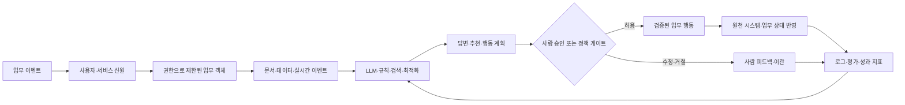
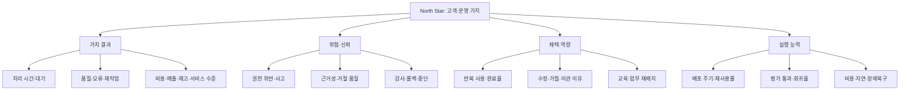

# AX 전환 가이드: AI를 조직의 운영 방식으로 만드는 법

> AX(AI Transformation)는 기존 업무에 AI 기능을 붙이는 프로젝트가 아니라, **회사가 가치를 만들고 의사결정하고 실행하는 방식을 AI 시대에 맞게 다시 설계하는 경영·제품·기술 전환**입니다.

- 대상: 기업 경영진, AX/DT 담당자, 현업 리더, 제품·데이터·AI 개발자
- 목적: “AI를 도입하자”를 실행 가능한 전환 프로그램으로 바꾸기
- 기준일: 2026-08-14
- 성격: 공식 표준의 요약 + 팔란티어 공개 패턴의 분석 + 이 저장소의 실행 권고

## 1. 먼저 결론

AX 전환은 다음 순서로 이뤄집니다.

```text
전략적 목표
   ↓
업무 병목·의사결정·고객 경험 발견
   ↓
가치·실현가능성·위험·채택을 기준으로 포트폴리오 선정
   ↓
업무 프로세스와 책임을 먼저 재설계
   ↓
데이터·업무 객체·권한·AI 플랫폼 기반 구축
   ↓
현업과 함께 작은 업무 제품을 개발
   ↓
평가·승인·감사·성과 지표를 포함해 파일럿
   ↓
채택된 업무를 표준화하고 여러 부서로 확장
   ↓
운영 데이터와 사용자 피드백으로 계속 개선
```

이를 한 문장으로 줄이면 다음과 같습니다.

> **업무의 목표와 의사결정 구조를 명확히 한 뒤, AI가 읽고 추천하고 행동할 수 있는 범위를 권한·데이터·평가·사람의 승인으로 설계하고, 측정 가능한 업무 제품으로 확산한다.**

AI 도입 개수나 모델 성능만으로 AX를 평가하면 안 됩니다. 다음 다섯 항이 함께 좋아져야 합니다.

```text
AX 성과 = 전략 적합성
        × 업무 재설계 수준
        × 데이터·기술 기반
        × 현업 채택·역량
        × 지속 가능한 거버넌스
```

곱셈으로 표현한 이유는 한 항이 0이면 전체 전환이 멈추기 때문입니다. 모델이 좋아도 현업이 사용하지 않으면 성과가 없고, 사용자가 많아도 권한과 감사가 없으면 확장할 수 없습니다.

## 2. AX란 무엇인가

### 2.1 DX·자동화·AI 도입·AX의 차이

| 개념 | 중심 질문 | 대표 산출물 | 한계 |
|---|---|---|---|
| 디지털화 | 종이·수작업을 디지털 데이터로 바꿀 수 있는가? | 전자 문서, 시스템 입력 | 디지털화된 비효율이 그대로 남을 수 있음 |
| DX | 디지털 기술로 고객·업무 운영을 어떻게 바꿀 것인가? | 통합 채널, 데이터 플랫폼, 프로세스 혁신 | AI가 만드는 새로운 판단·행동은 별도 설계 필요 |
| 자동화 | 반복 규칙을 사람이 하지 않게 만들 수 있는가? | RPA, 배치, 워크플로 | 예외·모호한 판단에는 약함 |
| AI 도입 | 모델이 특정 작업을 더 잘할 수 있는가? | 분류, 예측, 검색, 생성 기능 | 기능이 업무·책임·성과와 분리되기 쉬움 |
| AX | AI와 사람이 함께 일하도록 가치 창출·의사결정·실행을 다시 설계했는가? | AI 업무 제품, 새 역할·통제·KPI, 확장 가능한 운영모델 | 기술 외에 조직·변화·거버넌스까지 필요 |

AX는 DX의 대체어가 아닙니다. DX가 디지털 기반과 고객·업무 모델을 바꾸는 큰 우산이라면, AX는 그 안에서 AI가 판단·생성·예측·조정·실행에 참여하도록 업무와 운영체계를 다시 만드는 전환입니다.

### 2.2 AX의 대상은 작업이 아니라 업무 시스템이다

한 작업을 자동화하는 것만으로는 AX가 완성되지 않습니다. 다음 요소를 함께 봐야 합니다.

```text
목표: 무엇을 개선해야 하는가?
대상: 어떤 고객·주문·설비·계약·사건을 다루는가?
판단: 어떤 정보와 규칙으로 결정하는가?
행동: 결정 후 어떤 시스템·사람·자원에 영향을 주는가?
책임: 누가 승인·설명·수정·중단하는가?
학습: 결과와 피드백을 어떻게 다음 판단에 반영하는가?
```

예를 들어 “고객 문의 답변을 생성한다”는 작업은 다음 업무 시스템의 일부입니다.

- 고객의 계약·주문·이전 상담 이력에 접근할 수 있는가?
- 답변이 가능한 정책과 불가능한 약속을 구분하는가?
- 환불·배송 변경·개인정보 수정은 별도 승인 행동인가?
- 답변의 근거와 상담 결과를 CRM에 기록하는가?
- 잘못된 답변을 누가 발견하고 회수하는가?

### 2.3 AX의 다섯 가지 가치 형태

AX 포트폴리오를 아래 다섯 형태로 나누면 “챗봇만 만들기”에서 벗어나기 쉽습니다.

| 형태 | AI의 역할 | 업무 변화 | 시작하기 좋은 예 |
|---|---|---|---|
| Assist | 찾기·요약·초안 | 사람이 하던 탐색·작성 시간을 줄임 | 내부 지식 검색, 회의·티켓 요약 |
| Augment | 판단 보조·예측·추천 | 사람이 더 빠르고 일관되게 결정 | 수요 예측, 위험 우선순위, 대안 비교 |
| Automate | 조건부 실행 | 저위험 반복 업무를 자동 처리 | 태그 변경, 승인 요청, 정형 알림 |
| Orchestrate | 여러 단계 계획·도구 조정 | 업무 흐름과 시스템 사이의 조정 비용을 줄임 | 주문 예외 처리, 장애 대응, 공급 회복 |
| Reinvent | 제품·수익·운영 모델 재설계 | 기존에 불가능하거나 비쌌던 가치를 새로 제공 | 실시간 개인화, 지능형 현장 서비스 |

대부분의 기업은 Assist에서 시작하되, 목표는 단순 생산성 기능의 수를 늘리는 것이 아니라 Augment·Automate·Orchestrate로 가치 사슬을 연결하는 것입니다. Reinvent는 기반·채택·거버넌스가 검증된 뒤 별도 사업 전략으로 다뤄야 합니다.

## 3. AX 전환의 일곱 축

AX를 기술 부서만의 과제로 만들지 않으려면 아래 축을 동시에 관리해야 합니다.

| 축 | 전환 전 질문 | 전환 후 상태 | 확인 증거 |
|---|---|---|---|
| 전략 | 어느 업무에 AI를 쓸까? | 기업 목표·고객 가치와 연결된 AI 포트폴리오가 있는가? | 전략 맵, 투자 기준, 목표 지표 |
| 업무 | 기존 절차에 AI를 어디에 붙일까? | 불필요한 승인·입력·대기를 제거한 새 업무 흐름인가? | As-is/To-be, 상태 전이, RACI |
| 데이터 | 데이터가 어디에 흩어져 있나? | 핵심 업무 객체·상태·근거·계보를 재현할 수 있는가? | 데이터 계약, 객체 모델, 품질 지표 |
| 기술 | 어떤 모델을 살까? | 모델·검색·규칙·도구·시스템 반영이 계약으로 연결되는가? | API, 행동 스키마, 평가·관찰성 |
| 사람 | 직원이 AI를 쓸까? | 역할·권한·역량·성과 평가가 AI 협업 방식에 맞는가? | 교육, 채택률, 역할 정의 |
| 거버넌스 | 금지할 것은 무엇인가? | 위험 수준에 따라 승인·감사·중단·복구가 내장됐는가? | 위험 등록부, 정책, 로그, 승인 기록 |
| 가치 | 사용량이 늘었나? | 처리 시간·품질·비용·매출·위험·경험이 좋아졌는가? | 기준선, 비교군, 가치 실현 보고서 |

이 중 기술만 진행되고 다른 축이 멈추면 AX는 “AI 기능을 가진 기존 업무”로 되돌아갑니다.

## 4. AX 전환을 시작하는 방법

### Step 0. 최고경영진의 문제를 기술이 아닌 결과로 정의한다

경영진이 먼저 정해야 할 것은 “생성형 AI를 도입하자”가 아니라 다음 세 가지입니다.

1. 어떤 전략 목표를 가속할 것인가?
2. 어느 업무에서 반복되는 손실과 의사결정 지연이 발생하는가?
3. 어떤 위험과 원칙은 생산성보다 우선하는가?

좋은 North Star 예시:

> “고객의 문제를 접수한 뒤 적합한 해결 경로를 결정하는 시간을 줄이고, 사람이 검토해야 할 고위험 사례에 더 많은 시간을 쓰게 한다.”

나쁜 North Star 예시:

> “전 직원에게 AI 도구를 지급하고 AI 사용률을 높인다.”

### Step 1. 조직의 AI 현황을 사실로 파악한다

공식 프로젝트만 조사하면 실제 조직 상태를 놓칩니다. 다음 네 경로를 함께 조사합니다.

| 조사 대상 | 확인할 것 | 방법 |
|---|---|---|
| 공식 시스템 | 데이터·API·권한·로그 | 아키텍처와 접근권한 inventory |
| 현업 수작업 | 엑셀·메일·메신저·개인 스크립트 | 작업 관찰·인터뷰·샘플 수집 |
| 비공식 AI 사용 | 어떤 모델에 어떤 정보가 입력되는가? | 익명 설문·보안 로그·사용자 인터뷰 |
| 변화 역량 | 누가 문제를 정의·개발·운영할 수 있는가? | 역할·스킬·교육·채용 진단 |

조사 결과는 기능 목록이 아니라 다음 카드로 정리합니다.

```text
업무: 공급 지연 주문 대응
사용자: 구매 담당자
현재 입력: ERP, 이메일, 계약서, 전화
현재 손실: 수작업 탐색 90분, 담당자별 판단 편차
현재 결정: 납기 위험·대체 공급업체·승인 필요 여부
현재 행동: 구매주문 수정 또는 협력사 연락
제약: 계약·금액 한도·권한·대외 커뮤니케이션
기준선: 처리 시간, 재작업, 납기 회복률
```

### Step 2. 유스케이스 포트폴리오를 만든다

모든 업무를 동시에 AI화하지 않습니다. 후보마다 다음 점수를 매깁니다.

```text
우선순위 점수
= (업무 가치 × 전략 적합성 × 반복성 × 데이터 준비도 × 채택 가능성)
  ÷ (위험도 × 통합 난이도 × 변화 부담)
```

정밀한 수학 모델이 아니라 투자 논의를 일관되게 만드는 장치입니다. 각 항목을 1~5로 점수화하고, 위험도는 분모에 두어 과장된 가치가 위험을 덮지 못하게 합니다.

| 평가 항목 | 1점 | 3점 | 5점 |
|---|---|---|---|
| 업무 가치 | 효과가 불분명 | 팀 단위 시간·품질 개선 | 핵심 고객·비용·매출·안전 목표와 직접 연결 |
| 전략 적합성 | 전략과 무관 | 부서 목표와 연결 | 전사 우선순위의 핵심 |
| 반복성 | 드물게 발생 | 주기적으로 발생 | 대량·매일·여러 부서에서 반복 |
| 데이터 준비도 | 출처·권한 불명 | 연결 가능하지만 품질 보완 필요 | 최신·계보·권한이 명확 |
| 채택 가능성 | 사용자가 반대 | 제한된 팀에서 검토 가능 | 업무 소유자와 챔피언이 있음 |
| 위험도 | 피해가 크고 비가역적 | 사람 승인 필요 | 저위험·가역적·검토 쉬움 |
| 통합 난이도 | 다수 레거시·불명확 API | 일부 연결 작업 | 안정된 API·워크플로 존재 |
| 변화 부담 | 역할·보상 체계 충돌 | 교육·절차 변경 필요 | 기존 업무에 자연스럽게 삽입 |

초기 후보는 점수가 가장 높은 것만이 아니라, **가치가 있고 위험·통합 부담이 관리 가능한 업무**를 선택해야 합니다. 전략적으로 중요하지만 위험이 큰 업무는 파일럿을 읽기·추천 단계로 제한합니다.

### Step 3. 업무 프로세스를 먼저 다시 설계한다

AI를 기존 프로세스의 한 칸에 붙이기 전에 `As-is`를 분해합니다.

```text
업무 시작 이벤트
 → 입력 수집
 → 사람이 찾고 복사함
 → 사람이 판단함
 → 승인 대기
 → 시스템에 재입력
 → 결과 확인
 → 예외 처리
```

각 단계에 다음 질문을 붙입니다.

- 이 단계는 고객·품질·규제·통제에 실제로 필요한가?
- 사람이 해야 하는 판단인가, 아니면 규칙·계산·검색으로 해결되는가?
- 입력을 한 번만 만들고 여러 시스템이 재사용할 수 있는가?
- AI가 추천해도 사람의 결정권과 책임은 어디에 남는가?
- 상태가 바뀌면 어떤 시스템·사람에게 알려야 하는가?
- 실패·거절·취소·재시도는 어떻게 되는가?

`To-be`는 “AI가 대신한다”가 아니라 역할을 다시 나눠야 합니다.

| 기존 단계 | AI·자동화 후보 | 사람의 역할 | 통제 |
|---|---|---|---|
| 여러 시스템에서 찾기 | 객체·문서 통합 검색 | 검색 결과의 의미 확인 | 출처·권한·기준 시각 |
| 후보 분류 | 규칙·모델·LLM 추천 | 경계 사례 판단 | 설명·불확실성 |
| 대안 비교 | 계산·최적화·시뮬레이션 | 사업 우선순위 선택 | 가정·영향 표시 |
| 기록·전달 | 구조화 초안·알림 | 승인·수정·대외 책임 | 행동 계약·감사 |
| 결과 확인 | 모니터링·예외 감지 | 이슈 조사·정책 개선 | 알림 한도·중단 |

### Step 4. 전환 대상의 객체·권한·상태를 모델링한다

AI가 업무에 참여하려면 “문서가 많다”보다 “어떤 업무 대상의 어떤 상태를 바꾸는가”가 명확해야 합니다.



이 구조는 팔란티어의 공개 Ontology·AIP 패턴을 일반 기업 설계로 번역한 것입니다. 모든 기업이 Palantir를 써야 한다는 뜻은 아닙니다. 핵심은 데이터·업무 의미·행동·보안·AI를 분리된 프로젝트로 두지 않는 것입니다.

### Step 5. AI 플랫폼보다 먼저 계약을 만든다

AX 플랫폼의 최소 계약은 네 가지입니다.

#### 데이터 계약

```yaml
dataset: purchase_orders
owner: procurement-data-owner
source_system: ERP
schema_version: v3
freshness_sla: 15m
lineage: ERP -> curated_orders -> risk_context
sensitivity: internal
access_policy: object-and-organization-scoped
quality_rules:
  - order_id is unique
  - due_date is not null for active orders
  - status is one of [OPEN, DELAYED, CLOSED]
```

#### 모델·프롬프트 계약

```yaml
use_case: supply_delay_triage
model_role: classify_and_explain
allowed_inputs: [order_state, supplier_state, approved_documents]
required_citations: true
must_abstain_when:
  - evidence_is_stale
  - required_field_missing
  - policy_conflict
output_schema: DelayTriageResult/v1
evaluation_suite: supply-delay-regression/v4
```

#### 행동 계약

```yaml
action: create_review_task
target: PurchaseOrder
allowed_roles: [buyer, procurement-manager]
preconditions:
  - target.status in [OPEN, DELAYED]
side_effects:
  - create_task
  - notify_internal_owner
approval: human_required
idempotency_key: target_id + action_version
rollback: close_review_task
audit_fields: [actor, evidence, policy, model, timestamp]
```

#### 운영 계약

```yaml
service_level:
  p95_latency: 10s
  availability: 99.5%
  max_cost_per_case: 0.05
stop_conditions:
  - permission_violation
  - duplicate_side_effect
  - critical_metric_regression
on_call: ax-operations
rollback_version: previous-approved-release
```

계약이 있으면 모델이 바뀌어도 업무 제품의 안전 경계를 유지할 수 있습니다.

### Step 6. 현업과 함께 수직 슬라이스를 만든다

AX 개발은 데이터팀이 데이터만 만들고, AI팀이 모델만 만들고, 현업이 마지막에 사용해보는 순서로 하면 실패하기 쉽습니다. 한 팀이 아래 흐름을 처음부터 끝까지 검증해야 합니다.

```text
실제 사용자 요청
 → 권한 확인
 → 맥락 검색
 → 모델·규칙 실행
 → 근거·불확실성 표시
 → 승인·수정·거절
 → 업무 시스템 반영
 → 로그·평가·성과 측정
```

권장 구성은 다음과 같습니다.

| 역할 | 주 책임 |
|---|---|
| Executive sponsor | 사업 우선순위·예산·부서 간 장애물 제거 |
| AX product owner | 문제·범위·KPI·출시 결정 |
| Domain SME | 업무 규칙·예외·정답·승인 흐름 |
| FDE/제품 엔지니어 | 현업 관찰·프로토타입·피드백·제품화 |
| Data engineer | 데이터 연결·품질·계보·신선도 |
| AI/LLM engineer | 검색·모델·프롬프트·도구·평가 |
| Application/SRE | UI·API·배포·관찰성·롤백 |
| Security/legal/risk | 개인정보·권한·규제·감사·공급망 위험 |
| Adoption lead | 교육·업무 절차·채택·변화 저항 관리 |

## 5. AX 전환 실행 모델

### 5.1 8단계 게이트

| 단계 | 핵심 질문 | 산출물 | 다음 단계 통과 조건 |
|---|---|---|---|
| 1. Align | 왜 지금 이 전환을 하는가? | North Star, 원칙, 투자 범위 | 경영진·업무 소유자 합의 |
| 2. Discover | 어디서 가치와 병목이 생기는가? | 업무·데이터·AI 현황 지도 | 후보 업무와 기준선 확인 |
| 3. Prioritize | 무엇부터 할 것인가? | 포트폴리오 점수·위험 등급 | 한두 개 파일럿 확정 |
| 4. Redesign | AI가 들어간 새 업무는 무엇인가? | As-is/To-be, 역할·상태·행동 | 승인·예외·중단 흐름 합의 |
| 5. Build | 어떤 기반과 제품이 필요한가? | 데이터·권한·도구·평가·앱 | 수직 슬라이스 동작 |
| 6. Pilot | 실제 업무에서 안전하게 가치가 나는가? | 기준선 비교·로그·피드백 | 하드 게이트와 KPI 통과 |
| 7. Scale | 다른 사용자·부서·환경에 재사용 가능한가? | 플랫폼 표준·운영 모델 | 운영비·지원·교육 준비 |
| 8. Renew | 무엇을 중단·개선·재설계할 것인가? | 포트폴리오 리뷰·학습 backlog | 분기별 투자 재배정 |

각 단계는 문서만 작성하는 관문이 아닙니다. 다음 단계에서 위험을 발견했으면 앞 단계로 돌아가는 것이 정상입니다.

### 5.2 30·60·90일 계획

#### 0~30일: 방향과 후보를 확정한다

- 전사 North Star와 금지 원칙을 정한다.
- 현업 인터뷰·업무 관찰·데이터 inventory를 완료한다.
- 후보 유스케이스 10~20개를 만들고 점수화한다.
- 위험도·데이터 준비도·시스템 연결 난이도를 확인한다.
- 첫 파일럿 1개, 예비 파일럿 1개를 선정한다.
- 현재 처리 시간·오류·대기·재작업의 기준선을 측정한다.

통과 기준: “누가 어떤 업무에서 무엇을 얼마나 개선하는가”를 숫자와 업무 객체로 설명할 수 있습니다.

#### 31~60일: 새 업무와 제품의 첫 세로 단면을 만든다

- 객체·상태·권한·데이터·행동 계약을 작성한다.
- 읽기 전용 검색·요약·추천을 현업에게 제공한다.
- 정상·경계·권한·실패·적대적 평가 세트를 만든다.
- 현업의 수정·거절·모름 사례를 라벨로 축적한다.
- 로그·추적·비용·지연·권한 차단을 관찰한다.
- 실행 기능은 가역적·저위험·승인 필수 범위로 제한한다.

통과 기준: 실제 사용자의 요청이 권한 확인부터 업무 결과·로그까지 한 번에 흐릅니다.

#### 61~90일: 파일럿 성과와 확장 조건을 검증한다

- 기존 방식과 AI 보조 방식을 비교한다.
- 사용자 채택률이 아니라 처리 시간·오류·재작업·승인 품질을 비교한다.
- 잔여 위험과 운영 비용을 문서화한다.
- 운영자 교육·장애·중단·롤백 훈련을 한다.
- 유지·확장·재설계·중단을 결정한다.
- 다음 유스케이스에 재사용할 공통 컴포넌트와 비재사용 부분을 분리한다.

통과 기준: “성공했다”가 아니라 어디까지 성공했고 무엇을 더 확인해야 하는지 설명할 수 있습니다.

### 5.3 3~12개월 확장 로드맵

| 기간 | 전환 초점 | 대표 결과 |
|---|---|---|
| 0~3개월 | 증거 만들기 | 1~2개 업무 제품, 기준선·평가·운영 로그 |
| 3~6개월 | 반복 가능한 개발 | 공통 권한·검색·행동·평가·배포 템플릿 |
| 6~9개월 | 포트폴리오 확장 | 3~5개 업무 흐름, 부서별 제품 스쿼드 |
| 9~12개월 | 운영 모델 정착 | 분기별 AI 투자·리스크 심사·역량 체계 |
| 12개월 이후 | 업무·제품 재창조 | 새로운 서비스·수익 모델·실시간 운영 |

확장은 파일럿 수를 늘리는 것이 아니라, **같은 데이터·권한·평가·운영 원칙을 더 많은 업무에 재사용하면서도 업무별 소유권을 보존하는 것**입니다.

## 6. 업무별 AX 적용 지도

| 영역 | 후보 업무 | AI 역할 | 사람의 최종 역할 | 주요 위험 |
|---|---|---|---|---|
| 고객·서비스 | 문의 분류, 상담 지원, 이탈 위험 | Assist/Augment | 공감·예외·보상 결정 | 개인정보·잘못된 약속 |
| 영업 | 계정 조사, 제안서 초안, 다음 행동 | Assist/Augment | 관계·가격·계약 판단 | 기밀·과장·편향 |
| 마케팅 | 세그먼트·콘텐츠·캠페인 분석 | Assist/Augment | 브랜드·대상·최종 승인 | 저작권·정보 오류 |
| 재무 | 마감 대사, 이상 거래, 예산 시나리오 | Augment | 회계·재무 승인 | 금전·규제·감사 |
| 조달 | 공급 위험, 대체안, 주문 초안 | Augment/Automate | 공급업체·계약·발주 승인 | 계약·납기·중복 발주 |
| 공급망 | 수요·재고·예외·배분 | Augment/Orchestrate | 서비스 수준·비용 절충 | 데이터 지연·연쇄 영향 |
| 제조·품질 | 불량 탐지, 원인 분석, 정비 지원 | Augment | 안전·품질 판정 | 물리적 안전·센서 오류 |
| 현장 서비스 | 방문 계획, 기술자 코파일럿, 부품 추천 | Assist/Augment | 현장 안전·고객 대응 | 현장 조건·책임 |
| 인사 | 사내 정책 검색, 교육·스킬 추천 | Assist/Augment | 채용·평가·징계 판단 | 차별·민감정보·노동 |
| 법무·컴플라이언스 | 계약 조항 비교, 규정 검색, 조사 보조 | Assist/Augment | 법적 해석·최종 의견 | 기밀·오판·특권 |
| IT·개발 | 장애 분석, 코드 초안, 테스트·배포 보조 | Assist/Automate | 변경 승인·보안·롤백 | 비밀값·공급망·장애 |

이 표는 도입 우선순위가 아닙니다. 같은 업무라도 데이터·위험·시스템·조직 상황에 따라 읽기 전용부터 시작해야 합니다.

## 7. 조직 운영 모델과 변화관리

### 7.1 중앙집중과 연합의 균형

| 모델 | 장점 | 위험 | 적합한 상황 |
|---|---|---|---|
| 중앙 CoE | 표준·보안·모델·인재를 모으기 쉬움 | 현업과 멀어지고 병목이 됨 | 초기 정책·플랫폼·공통 역량 |
| 부서 자율 | 현업 속도·문제 적합성이 높음 | 중복·권한 누락·품질 편차 | 도메인 특화 업무 |
| 연합형 | 중앙 표준 + 도메인 제품팀 | 역할과 인터페이스가 필요 | 대부분의 중견·대기업 AX |

권장 구조는 다음과 같습니다.

```text
AI/AX Steering Committee
  ├─ 전략·투자·위험 허용범위
  ├─ 중앙 AI Platform / Security / Data 팀
  │    └─ 공통 인증·정책·평가·관찰성·배포·컴포넌트
  └─ 도메인별 AI Product Squad
       └─ 현업 SME + 제품 + 데이터 + AI + 앱/SRE
```

중앙 조직은 모든 업무를 대신 만드는 팀이 아니라 안전한 공통 능력을 제공하는 팀이어야 합니다. 도메인 스쿼드는 업무 가치와 사용자 채택의 책임을 가져야 합니다.

### 7.2 직무와 보상도 바꾼다

AX를 도입하면서 “AI가 사람을 대체한다”는 메시지만 반복하면 사용자는 오류를 숨기거나 시스템을 우회합니다. 다음을 명확히 해야 합니다.

- AI가 맡는 반복 탐색·작성·모니터링과 사람이 맡는 책임 판단을 구분한다.
- 새 역할: AI 업무 설계자, 평가자, 데이터 스튜어드, 도메인 에이전트 오너, 모델 운영자.
- AI를 잘 쓰는 사람만 보상하지 말고, 안전한 피드백·문서화·업무 개선도 평가한다.
- 업무량이 줄어들면 어떤 고부가가치 업무로 재배치할지 먼저 공개한다.
- 현업이 거절·수정을 할 수 있어야 한다. 수동 승인만 강요하면 실질적 사람 통제가 아니다.

### 7.3 채택 퍼널

```text
인지 → 첫 사용 → 반복 사용 → 신뢰 형성 → 업무 습관화 → 동료 확산 → 개선 제안
```

각 단계의 장애가 다릅니다.

| 단계 | 측정 | 개입 |
|---|---|---|
| 인지 | 교육·접속·관심 | 실제 업무 데모·명확한 목적 |
| 첫 사용 | 첫 성공 시간 | 템플릿·온보딩·지원 |
| 반복 사용 | 주간 재사용률 | 기존 화면·업무 흐름에 삽입 |
| 신뢰 | 수정·거절·이관 이유 | 근거·불확실성·품질 개선 |
| 습관화 | 업무 성과·우회 사용 | SOP·역할·KPI에 통합 |
| 확산 | 부서별 복제·교육 | 챔피언·공통 컴포넌트 |
| 개선 | 현업 제안·회귀 결과 | 제품 backlog·평가 세트 반영 |

## 8. 거버넌스와 위험관리

### 8.1 NIST·ISO·OECD를 실무에 연결하기

NIST AI RMF Playbook은 Govern·Map·Measure·Manage 네 기능으로 AI 위험을 다루지만, 일률적인 순서의 체크리스트가 아니며 자발적 사용을 전제로 합니다. [NIST AI RMF Playbook](https://www.nist.gov/itl/ai-risk-management-framework/nist-ai-rmf-playbook)의 원칙을 AX 운영에 번역하면 다음과 같습니다.

| 프레임워크 | AX 운영으로 번역 |
|---|---|
| Govern | 정책·책임자·위험 허용범위·공급업체·변경·사고 대응을 정한다 |
| Map | 사용 맥락·영향받는 사람·데이터·권한·실패 피해를 그린다 |
| Measure | 품질·안전·공정성·보안·지연·비용·업무 가치를 측정한다 |
| Manage | 위험을 줄이고, 승인·중단·롤백·이관·재평가를 실행한다 |

[ISO/IEC 42001:2023](https://www.iso.org/standard/42001)은 조직 안에서 AI 관리시스템을 수립·구현·유지·지속 개선하기 위한 요구사항을 제시합니다. 이를 AX 프로그램에 적용할 때 인증을 곧바로 목표로 삼기보다, `Plan-Do-Check-Act` 방식의 정책·위험·운영 증거 체계로 이해하는 것이 좋습니다. ISO 인증이나 NIST 활용이 특정 법률·규제 준수를 자동 보장하지 않는다는 점은 분명히 해야 합니다.

[OECD AI Principles](https://www.oecd.org/en/topics/ai-principles.html)은 2024년에 업데이트되었으며 인간의 권리·민주적 가치, 투명성·설명가능성, 견고성·안전·보안, 책임성 등을 강조합니다. AX 설계에서는 이를 다음 질문으로 바꿉니다.

- 사용자는 AI와 상호작용하고 있다는 사실과 한계를 아는가?
- 결과의 근거와 이의제기 경로가 있는가?
- 피해가 발생할 때 사람의 감독·재검토·중단이 가능한가?
- 모델·데이터·행동의 책임과 추적성이 있는가?
- 개인정보·저작권·노동·환경 비용을 평가했는가?

### 8.2 위험 등급별 실행 수준

| 등급 | 예시 | AI 권한 | 필수 통제 |
|---|---|---|---|
| R0 정보 | 내부 검색·요약 | 읽기 | 출처·권한·데이터 최신성 |
| R1 업무 보조 | 분류·초안·추천 | 제안 | 현업 검토·수정·평가 |
| R2 제한 행동 | 내부 티켓·태그·승인 요청 | 가역적 행동 | allowlist·사전조건·감사·idempotency |
| R3 영향 행동 | 환불·발주·가격·인사 상태 | 계획·준비, 사람 실행 | 이중 승인·금액/범위 한도·롤백 |
| R4 고위험 | 안전·권리·규제 결정 | 참고 정보만 | 자동 실행 금지 또는 별도 법무·안전 체계 |

위험 등급은 모델의 지능이 아니라 행동의 결과와 피해 가능성으로 정합니다.

### 8.3 필수 정책 묶음

- 허용 AI 도구·모델·데이터 범위
- 개인·고객·영업·소스코드·규제 데이터 처리
- 프롬프트·문서·출력의 보존·마스킹·외부 전송
- 모델·프롬프트·검색·도구 변경 승인
- 업무별 사람 승인·대체 승인·중단 기준
- AI 오류·정보 유출·대외 오발송 사고 대응
- 벤더 보안·데이터 보존·재학습·서비스 중단 조건
- 사용자에게 AI 사용 사실과 결정 책임을 알리는 방식

## 9. 성과를 측정하는 방법

### 9.1 AI 사용량은 성과의 대리 지표일 뿐이다

다음 지표는 필요하지만 단독으로 성공을 말할 수 없습니다.

- 월간 사용자 수
- 질문·작업·토큰 수
- 생성된 문서 수
- 승인된 추천 수

사용량이 늘어도 재작업·오류·비용이 늘 수 있습니다. 반드시 기준선과 업무 결과를 같이 봅니다.

### 9.2 AX KPI 트리



### 9.3 선행 지표와 결과 지표

| 종류 | 예시 | 쓰임 |
|---|---|---|
| 선행 | 평가 케이스 커버리지, 데이터 최신성, 교육 이수, 첫 성공 시간 | 문제가 커지기 전에 개선 |
| 운영 | 성공률, P95 지연, 비용/건, 중단·롤백, 근거 부족률 | 제품을 안정적으로 운용 |
| 행동 | 승인·수정·거절·이관, 재사용률, 우회 사용 | 신뢰와 채택 진단 |
| 결과 | 처리 시간, 오류, 재작업, 비용, 매출, 납기, 고객 만족 | 투자 효과 판단 |

### 9.4 가치 실현 계산의 주의점

```text
순가치
= 절감 또는 추가 매출
 - 모델·컴퓨트·데이터·통합·운영 비용
 - 교육·변화·감사·지원 비용
 - 오류·사고·재작업의 기대 비용
```

“AI가 1시간을 절약했다”는 곧바로 인건비 절감이 아닙니다. 절약된 시간이 처리량 증가·대기 감소·고부가 업무·고용 재배치 중 어디로 이동했는지 확인해야 합니다.

## 10. 실제 예시: 공급 지연 대응 AX 전환

### 10.1 문제

구매 담당자가 ERP·협력사 메일·계약서·재고 정보를 따로 확인해 납기 위험 주문을 찾고, 대체안과 승인 필요 여부를 판단합니다. 이 업무가 반복되며 담당자마다 근거와 우선순위가 다릅니다.

### 10.2 As-is

```text
ERP 추출 → 엑셀 정리 → 메일 검색 → 계약 확인 → 담당자 판단
        → 관리자에게 메일 → ERP 재입력 → 결과 추적 어려움
```

### 10.3 To-be

```text
지연 이벤트
  → 주문·공급업체·자재·재고 객체 조회
  → 계약·메일·센서의 권한 필터 검색
  → 위험 원인·대체안·영향을 구조화해 추천
  → 구매 담당자가 근거를 검토·수정
  → 승인 요청 또는 내부 검토 태스크 생성
  → 승인된 경우에만 주문 상태 변경
  → 납기 회복·비용·수정 이유를 기록
```

### 10.4 단계별 출시

| 버전 | 범위 | 성공 기준 |
|---|---|---|
| V0 | 지연 주문 검색·요약 | 수작업 탐색 시간 감소, 출처 표시 |
| V1 | 위험 원인·우선순위 추천 | 과거 케이스 평가와 현업 수용 |
| V2 | 대체안 비교·승인 초안 | 사람 승인 전에는 원장 변경 없음 |
| V3 | 내부 검토 태스크·상태 변경 | 권한·중복·롤백·감사 검증 |
| V4 | 제한된 자동화 | 저위험·가역 조건에서 운영 지표 개선 |

이 예시는 특정 벤더 제품의 복제를 요구하지 않습니다. 핵심은 “챗봇이 납기 위험을 말해준다”에서 멈추지 않고, **객체·근거·추천·승인·업무 상태·성과를 하나의 루프로 만든다**는 것입니다.

## 11. 실패 패턴과 교정법

| 실패 | 증상 | 교정 |
|---|---|---|
| 전사 챗봇부터 시작 | 사용자는 많지만 업무 결과가 없음 | 병목 업무와 기준선부터 선정 |
| AI 사용률을 핵심 KPI로 둠 | 사용자는 질문하지만 실제 절차는 그대로 | 처리 시간·오류·재작업·채택을 측정 |
| 모델 선정 경쟁 | 모델 교체 때마다 시스템 재개발 | 데이터·행동·평가 계약을 모델과 분리 |
| 기존 절차에 AI 한 칸 추가 | 승인·입력·대기가 더 늘어남 | As-is/To-be와 의사결정권을 재설계 |
| PoC를 운영으로 오해 | 실제 권한·장애·비용·감사가 없음 | 파일럿부터 운영 계약·중단·롤백을 포함 |
| 데이터 레이크만 구축 | 데이터는 많지만 의미·소유·상태 불명 | 업무 객체·계보·품질·권한 모델링 |
| 사람을 배제하거나 승인 버튼으로 축소 | 우회 사용·불신·책임 공백 | 사람의 판단과 피드백을 제품에 설계 |
| 중앙 조직이 모든 것을 만듦 | 현업 적합성과 속도가 떨어짐 | 중앙 플랫폼 + 도메인 제품 스쿼드 |
| 위험을 법무 검토 마지막에 둠 | 출시 직전 전면 재설계 | 발견 단계부터 위험 등급과 금지 행동 정의 |
| 성공 사례 수치를 복사 | 기준선·정의·비교군이 없음 | 내 업무의 기준선과 증거로 재측정 |

## 12. 주간 운영 리듬

AX 전환은 일회성 프로젝트가 아니라 운영 리듬이어야 합니다.

| 주기 | 회의·활동 | 결정할 것 |
|---|---|---|
| 매일/상시 | 장애·정책 위반·고위험 행동 감시 | 중단·이관·복구 |
| 주간 | 현업 사례·오류·수정·거절 리뷰 | backlog·평가 케이스·프롬프트/규칙 |
| 격주 | 제품 데모·실제 업무 관찰 | 범위·UX·업무 절차 변경 |
| 월간 | KPI·비용·채택·위험 검토 | 유지·제한·확장·재설계 |
| 분기 | 포트폴리오·투자·조직 역량 리뷰 | 다음 업무·예산·인력·정책 |

주간 리뷰에서 “모델이 왜 틀렸나”만 묻지 말고 다음을 함께 묻습니다.

- 데이터가 최신이고 권한에 맞았는가?
- 업무 규칙과 승인 구조가 명확했는가?
- 사용자가 결과를 믿고 다음 행동을 할 수 있었는가?
- AI를 넣지 않아도 제거할 수 있었던 불필요한 단계는 무엇인가?

## 13. AX 프로그램을 시작할 때 만드는 문서 목록

| 문서 | 작성 시점 | 목적 |
|---|---|---|
| AX North Star one-pager | Align | 전환 이유·범위·원칙 합의 |
| AI 현황·업무 지도 | Discover | 시스템·수작업·비공식 사용 파악 |
| 유스케이스 포트폴리오 | Prioritize | 가치·실현성·위험 비교 |
| As-is/To-be 업무 설계 | Redesign | 역할·상태·의사결정 재설계 |
| 데이터·업무 객체 카탈로그 | Build | 출처·상태·소유·신선도 정리 |
| 행동·권한 계약 | Build | AI가 할 수 있는 변경 제한 |
| 평가 세트·판정 기준 | Build/Pilot | 출시 전후 품질·안전 검증 |
| 위험 등록부·승인 기록 | Govern | 위험·완화·책임·잔여 위험 추적 |
| 운영·중단·롤백 runbook | Pilot | 실제 장애·사고 대응 |
| 가치 실현 보고서 | Pilot/Scale | 기준선 대비 결과·비용·다음 투자 판단 |

이 저장소의 [AX 기술 파이프라인·시스템 설계](AX-TECHNICAL-PIPELINE.md), [AX 유스케이스 캔버스](AX-USE-CASE-CANVAS.md), [AI 평가 루브릭](EVALUATION-RUBRIC.md), [AX 프로그램 캔버스](AX-PROGRAM-CANVAS.md), [성숙도 평가](AX-MATURITY-ASSESSMENT.md)를 이 문서와 함께 사용합니다.

## 14. 시작 전 최종 체크리스트

### 전략·가치

- [ ] AI 프로젝트가 아니라 전략 목표와 업무 병목으로 설명된다.
- [ ] 기준선·목표·비교 방법·중단 조건이 있다.
- [ ] 파일럿 소유자와 최종 의사결정자가 정해졌다.

### 업무·조직

- [ ] As-is와 To-be의 역할·상태·승인·예외가 그려졌다.
- [ ] 현업 SME가 평가·출시·회고에 참여한다.
- [ ] AI 사용으로 바뀌는 역할·교육·업무 재배치가 설명된다.

### 데이터·기술

- [ ] 핵심 업무 객체·출처·계보·신선도·권한이 정의됐다.
- [ ] 모델·검색·규칙·최적화·도구의 역할이 분리됐다.
- [ ] 출력과 행동에 타입·사전조건·idempotency·롤백이 있다.

### 안전·운영

- [ ] 정상·경계·권한·적대적·실패·회귀 평가가 있다.
- [ ] 근거·로그·비용·지연·승인·수정·거절을 관찰한다.
- [ ] 중단·수동 전환·사고 대응·복구를 연습했다.
- [ ] 공급업체·개인정보·저작권·규제·노동 영향을 검토했다.

### 확장

- [ ] 공통 플랫폼 기능과 도메인별 업무 규칙이 분리됐다.
- [ ] 다음 업무가 재사용할 수 있는 컴포넌트와 평가 세트가 있다.
- [ ] 분기별 포트폴리오 리뷰와 투자 재배정이 예정돼 있다.

## 15. 면접·스터디용 설명

### 30초 답변

“AX 전환은 LLM을 기존 업무에 붙이는 것이 아니라, 회사의 전략 목표에 맞춰 업무 프로세스와 의사결정 구조를 다시 설계하고 AI를 그 안의 조회·추천·행동 계층으로 운영하는 것입니다. 먼저 업무 병목과 기준선을 찾고, 데이터·업무 객체·권한·행동 계약을 만든 뒤, 현업과 작은 파일럿을 평가·승인·감사까지 포함해 배포합니다. 성과는 AI 사용량이 아니라 처리 시간·품질·비용·위험·채택의 변화로 판단합니다.”

### 2분 답변 순서

1. 왜 이 업무를 바꿔야 하는지 전략 목표와 기준선으로 설명한다.
2. 현재 프로세스에서 반복 탐색·판단·입력·대기를 분리한다.
3. 객체·상태·데이터·권한·사람의 의사결정을 모델링한다.
4. Assist→Augment→Automate 순서로 위험을 단계화한다.
5. 평가·관찰성·승인·롤백을 제품의 일부로 만든다.
6. 파일럿 결과를 비교군과 업무 KPI로 판단하고, 재사용 가능한 플랫폼으로 확장한다.

### 스스로 답해볼 질문

- 우리 회사의 AX North Star는 비용 절감이 아니라 어떤 고객·업무 가치를 바꾸는가?
- AI가 가장 먼저 읽어야 할 업무 객체와 상태는 무엇인가?
- AI가 추천할 수 있지만 실행하면 안 되는 행동은 무엇인가?
- 현업의 거절·수정은 어떤 학습 데이터와 제품 개선으로 연결되는가?
- 파일럿이 성공해도 전사 확장을 보류해야 하는 조건은 무엇인가?

## 맺음말

AX는 “AI를 도입한 회사”가 되는 프로젝트가 아닙니다. **일하는 방식, 책임지는 방식, 데이터를 다루는 방식, 고객에게 가치를 전달하는 방식을 AI와 함께 다시 설계하는 운영체계 전환**입니다.

따라서 첫 질문은 “어떤 모델을 쓸까?”가 아니라 다음이어야 합니다.

> “우리 조직에서 사람의 시간이 가장 많이 소모되지만, 더 나은 데이터·근거·도구·승인 구조가 있으면 훨씬 좋은 결정을 내릴 수 있는 업무는 무엇인가?”

그 업무를 골라 기준선을 측정하고, 프로세스를 재설계하고, 작은 수직 슬라이스를 운영하고, 증거가 쌓이면 확장하는 것이 AX 전환의 현실적인 시작점입니다.

