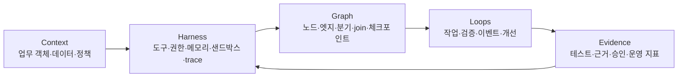
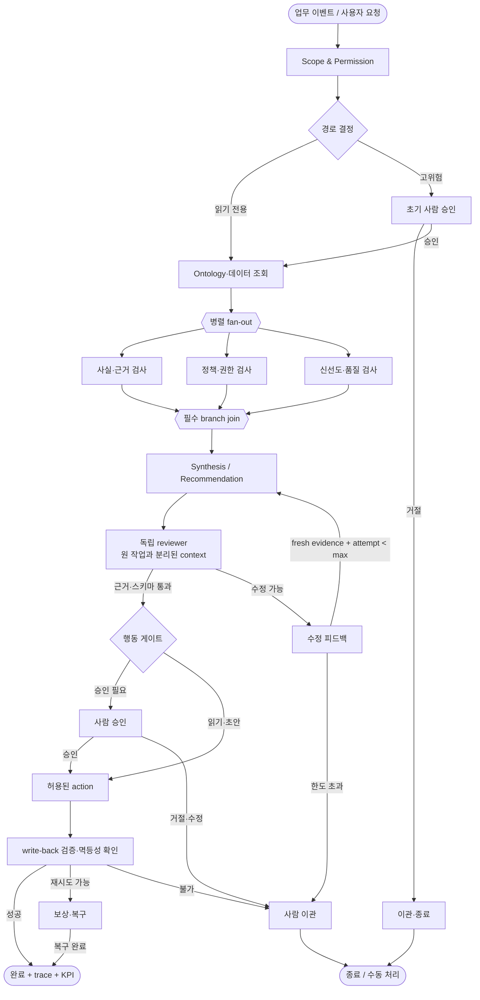

# AX 그래프 엔지니어링 플레이북

> **목적:** 에이전트가 무엇을 할지뿐 아니라 **다음에 어느 컴포넌트가 실행되고, 어떤 상태가 이동하며, 어떤 조건에서 멈추거나 사람에게 이관되는지**를 설계한다.
>
> **상태:** `design-only` · 이 문서는 Palantir 계정이나 실제 업무 시스템에서 실행·검증된 구현이 아니라 AX 학습·설계용 적용본입니다.
>
> **자료 확인 기준일:** 2026-08-18

## 1. 한 줄 결론

그래프 엔지니어링은 그래프 데이터베이스나 GNN을 먼저 도입하는 일이 아니다. 업무를 수행하는 에이전트의 **노드·엣지·공유 상태·분기·병렬 fan-out·join·승인·체크포인트·복구 경로**를 명시해, 실행 흐름을 관찰하고 재현하고 통제할 수 있게 만드는 일이다.

이 레포에서는 다음 세 층을 함께 설계한다.



| 층 | 통제하는 것 | 실패 신호 | 먼저 고칠 대상 |
|---|---|---|---|
| Harness Engineering | 모델이 접근할 환경과 결과의 영향 범위 | 도구가 없거나 과도함, 상태 유실, 권한·감사 불가 | 도구 계약, 권한, 저장소, 격리, 관찰성 |
| Loop Engineering | 반복·피드백·종료·예산 | 근거 없이 재시도하거나 성공 전에 멈춤 | evaluator, fresh evidence, max attempt, escalation |
| Graph Engineering | 상태가 이동하는 실행 토폴로지 | 분기·병렬·승인·복구가 if문과 프롬프트에 묻힘 | 노드·엣지·상태·join·checkpoint |

세 층은 대체 관계가 아니다. 그래프는 harness 안에서 실행되고, loop는 그래프 안에 놓이며, harness는 상태·도구·평가기를 제공한다. 하나의 모델을 더 강한 모델로 바꾸기 전에 실패가 환경인지, 피드백인지, 흐름인지 먼저 분류한다.

## 2. 이 문서가 말하는 그래프의 범위

AX에서 `graph`라는 말은 서로 다른 네 가지 대상을 가리킬 수 있다. 먼저 어떤 그래프를 만드는지 고정해야 한다.

| 대상 | 질문 | Palantir AX에서의 대응 | 이 플레이북의 위치 |
|---|---|---|---|
| 업무·지식 그래프 | 어떤 고객·자산·주문·이벤트가 어떤 관계인가? | Ontology의 객체·링크·속성·상태 | 입력 맥락·의미 계층 |
| 실행·제어 그래프 | 다음에 어떤 노드가 실행되고 어떤 상태가 넘어가는가? | AIP Agent/Logic, Actions, Machinery 등으로 구현할 수 있는 업무 흐름 | **주 대상** |
| 데이터 파이프라인 그래프 | 어떤 데이터가 어디서 와서 어떤 변환을 거치는가? | Foundry 데이터셋·Pipeline·계보 | 데이터 계약·품질 |
| 그래프 ML/GNN | 관계 구조에서 예측·표현을 학습할 수 있는가? | 선택적 분석·모델 계층 | 첫 파일럿의 필수 조건 아님 |

따라서 Ontology를 만들었다고 실행 그래프가 완성되는 것도 아니고, 그래프 DB를 설치했다고 업무 AX가 되는 것도 아니다. 이 문서는 **상태를 가진 실행 그래프**를 중심으로 Ontology·데이터·행동·평가를 연결한다.

## 3. 출처 경계와 학습 포인트

사용자가 제공한 [@0xwhrrari의 X 게시물](https://x.com/0xwhrrari/status/2086784668003598356?s=46)을 출발점으로 삼았다. 현재 작업 환경에서는 해당 X 페이지의 본문을 직접 추출할 수 없었기 때문에, 그 게시물의 문장을 그대로 인용하거나 게시물 하나의 내용으로 단정하지 않는다. 대신 공개적으로 확인 가능한 관련 설명의 공통 구조인 **harness·loop·graph의 역할 분리, 상태 전이·분기·병렬·join·복구, 증거 기반 종료, 그래프를 너무 일찍 고정하지 않는 원칙**을 이 저장소의 Palantir AX 설계 언어로 재작성했다.

교차 확인에 사용한 자료는 다음과 같다.

- [Agentic Engineering — Cold Mountain Wiki](https://www.coldmountain.ai/wiki/tools/agentic-engineering): harness·loop·graph를 환경·피드백·흐름으로 분리하고 실패 층을 진단하는 2차 정리
- [Agent Harness vs. Loop vs. Graph Engineering — Today for AI](https://todayforai.com/en/guides/20260726-guide-three-agent-engineering-architectures): 노드·엣지·상태·분기·join·주기·체크포인트와 적용 조건을 설명하는 2차 정리
- [LangGraph](https://github.com/langchain-ai/langgraph): 장기 실행·상태 보존형 그래프 오케스트레이션을 살펴볼 수 있는 구현 레퍼런스
- [Temporal](https://github.com/temporalio/temporal): 내구성 있는 워크플로·재개·복구의 일반 오케스트레이션 레퍼런스
- [NetworkX](https://github.com/networkx/networkx): 그래프 토폴로지 검사·분석용 레퍼런스. 런타임 엔진으로 오해하지 않는다.

위 자료는 이 레포의 내부 절차를 만드는 참고자료이지 Palantir 공식 지원, 특정 제품의 성능 보증, 팔란티어 내부 사내 시스템의 공개 증거가 아니다.

## 4. 그래프를 도입할지 결정하는 기준

그래프는 복잡해 보이기 때문에 도입하는 장식이 아니다. 다음 질문 중 **두 개 이상이 실제 업무에서 반복**되면 실행 그래프 후보로 삼는다.

| 질문 | `YES`일 때 필요한 그래프 요소 |
|---|---|
| 여러 전문 역할이 정해진 순서로 작업하는가? | typed node, ordering edge |
| 서로 의존하지 않는 조사·검사를 동시에 할 수 있는가? | fan-out, parallel branch, join |
| 특정 상태·근거·정책에 따라 경로가 달라지는가? | conditional router, typed condition |
| 사람 승인 전후의 상태가 분리되어야 하는가? | approval node, interrupt/resume |
| 실패 지점부터 재개해야 하는가? | checkpoint, resumable state |
| 일부 오류는 재시도하고 일부는 이관해야 하는가? | retry edge, escalation edge |
| 동일 실행을 다시 재현·감사해야 하는가? | immutable graph version, trace alignment |

반대로 단순 질의응답, 한 에이전트가 세 개 이하의 읽기 도구를 사용하는 작업, 경로가 계속 새롭게 발명되는 탐색 작업에는 먼저 최소 harness와 bounded loop를 사용한다. 충분한 trace가 쌓이기 전 수십 개 노드를 먼저 고정하면 실제 업무가 아니라 상상한 업무를 자동화하게 된다.

### Trace first, formalize second

1. 최소 도구·최소 권한 harness로 대표 케이스를 관찰한다.
2. 각 실행에서 `model call → tool call → observation → decision`을 기록한다.
3. 반복되는 경계와 실제 병목만 node 후보로 추출한다.
4. 성공·실패·승인·복구의 실제 전이를 edge로 승격한다.
5. 그래프 버전으로 고정한 뒤, 고정하지 않은 동적 계획 부분과 구분한다.

## 5. 실행 그래프의 기본 계약

### 5.1 Node 계약

노드는 “에이전트 하나”와 같은 말이 아니다. 결정적 함수, 검색기, LLM 호출, 전문 에이전트, 독립 reviewer, 사람 승인 단계가 모두 노드가 될 수 있다.

| 필드 | 의미 | 필수 규칙 |
|---|---|---|
| `node_id` | 그래프 안의 안정적인 식별자 | 그래프 버전 내 유일해야 함 |
| `node_type` | `deterministic`, `agent`, `reviewer`, `router`, `approval`, `event`, `recovery`, `terminal` | 허용 목록 밖 타입 금지 |
| `input_schema` | 읽을 상태의 구조 | 필요한 필드만 allowlist |
| `output_schema` | 다음 노드로 넘길 결과 | 자유 텍스트만으로 전달하지 않음 |
| `side_effect` | `read`, `draft`, `write`, `external` | `write/external`은 정책·승인 연결 |
| `evidence_required` | 완료 판정에 필요한 증거 | “모델이 완료라고 말함”은 증거가 아님 |
| `timeout`·`budget` | 시간·호출·토큰·비용 한도 | 상위 그래프 한도보다 클 수 없음 |
| `owner` | 실패 시 책임지고 수정할 주체 | `unknown` 금지 |

### 5.2 Edge 계약

엣지는 단순히 “다음 함수 호출”이 아니라 **어떤 조건에서 상태가 어느 노드로 이동하는지**를 고정한다.

| 엣지 유형 | 허용 조건 | 예시 |
|---|---|---|
| `success` | 출력 스키마·필수 근거 통과 | `research → synthesize` |
| `failure` | 결정적 검증 실패·도구 오류 | `draft → repair` |
| `retry` | 새 증거를 얻을 수 있고 attempt 한도 미만 | `retrieve → retrieve` |
| `escalate` | 한도 초과·권한·정책·불확실성 | `review → human_gate` |
| `parallel` | 서로 쓰는 상태가 겹치지 않거나 merge 규칙 존재 | `research → source_check` + `fact_check` |
| `join` | fan-out의 모든 필수 branch가 종료 | `source_check + fact_check → synthesize` |
| `interrupt/resume` | 사람 승인·외부 이벤트·서비스 재개 | `approval → action` |
| `compensate` | 이미 발생한 변경을 안전하게 되돌림 | `write → rollback` |

엣지 조건은 모델의 자연어 판단에만 맡기지 않는다. 스키마 검증·권한 판정·근거 개수·freshness·사람의 승인·업무 상태 전이를 가능한 한 결정적 predicate로 표현한다.

### 5.3 상태 계약

상태는 모든 노드에 전체 대화 기록을 복사하는 방식이 아니다. 다음 노드가 실행하는 데 필요한 최소 상태만 전달하고, 큰 원문·비밀값·권한 없는 객체는 참조 ID와 접근 정책으로 분리한다.

```yaml
graph_run:
  graph_id: supply-risk-triage
  graph_version: 2026-08-18.1
  run_id: run-opaque-id
  use_case_id: uc-supply-risk-001
  actor:
    subject_id: user-opaque-id
    role: planner
  state: running | waiting_approval | succeeded | failed | escalated | cancelled
  started_at: 2026-08-18T09:00:00+09:00
  data_as_of: 2026-08-18T08:55:00+09:00
  policy_version: policy-2026-08-18
  budget:
    max_node_attempts: 3
    max_total_seconds: 900
    max_external_writes: 1
  checkpoint:
    last_completed_node: source-check
    state_ref: state://opaque-ref
  evidence_refs:
    - ev-schema-001
    - ev-source-004
  escalation:
    owner: supply-ops
    reason: null

node_run:
  node_id: source-check
  node_run_id: node-run-opaque-id
  attempt: 1
  input_ref: state://input-ref
  output_ref: state://output-ref
  status: succeeded | failed | skipped | waiting
  evidence_refs: [ev-source-004]
  tool_calls: [tool-call-opaque-id]
  started_at: 2026-08-18T09:01:00+09:00
  finished_at: 2026-08-18T09:01:08+09:00
```

보안상 `state_ref`, `input_ref`, `output_ref`, `tool_calls`는 실제 고객 데이터·토큰·원문을 이 문서에 넣지 않는 불투명 참조다. 실제 구현에서는 보존 기간, 삭제, 접근 로그, 지역·규제 조건을 별도 계약으로 확정한다.

## 6. AX용 표준 토폴로지

다음 패턴은 “조사 → 검증 → 합성 → 승인 → 업무 변경 → 사후 검증” 형태의 읽기 우선 파일럿에 사용할 수 있다.



이 구조의 중요한 점은 reviewer와 action이 별도 노드라는 것이다. 모델의 추천과 업무 시스템의 변경을 같은 호출로 묶지 않는다. `JOIN`은 branch가 모두 끝났다는 사실만 확인하며, 서로 다른 branch의 결과를 어떻게 합치는지는 명시적인 merge 규칙으로 둔다.

### 6.1 네 가지 loop를 그래프에 배치한다

| loop | trigger | evidence | stop / escalation |
|---|---|---|---|
| Agent loop | 현재 node가 다음 tool·subtask를 선택 | 실제 tool output·관찰 결과 | node 완료·오류·timeout |
| Verification loop | reviewer·테스트가 실패 피드백을 반환 | schema, source, test, policy, SME 결과 | pass, max attempt, 사람 이관 |
| Event loop | 새 이벤트·스케줄·데이터 갱신 | 이벤트 ID, freshness, dedup key | 처리 완료·중복 무시·DLQ |
| Improvement loop | trace·사용자 수정·운영 지표 | 동일 케이스 전후 평가와 원인 분류 | 승격·보류·rollback |

모든 loop에는 `goal`, `state`, `action policy`, `evidence`, `feedback`, `stopping rule`이 있어야 한다. `keep trying`은 설계가 아니다.

### 6.2 병렬·join 설계 규칙

병렬화는 속도를 위한 기술이 아니라 독립성에 대한 주장이다.

- 각 branch가 실제로 읽기·쓰기 의존성이 없는지 확인한다.
- 공유 상태를 갱신한다면 field-level merge 규칙과 충돌 처리자를 둔다.
- `join`은 모든 필수 branch가 종료되기 전 합성하지 않는다.
- 선택 branch와 필수 branch를 구분한다. 선택 branch 실패가 전체를 막는지 문서화한다.
- branch별 timeout·비용·권한을 따로 기록한다.
- 병렬 결과를 같은 모델의 한 context에서 자기 검토한 것으로 대체하지 않는다. 독립 reviewer가 필요한 경우 별도 context와 별도 trace를 사용한다.

## 7. Palantir AX에 적용하는 설계 지도

이 표는 제품 내부 구현을 단정하는 매핑이 아니라 공개 제품 개념을 실행 그래프 설계 요소에 대응시킨 학습 지도다.

| 그래프 설계 요소 | Palantir AX의 공개 개념과 연결 | 적용 규칙 |
|---|---|---|
| Context / object state | Ontology 객체·링크·속성·상태 | node가 필요한 객체와 기준 시각만 읽도록 객체·필드 계약을 둔다 |
| Read node | Foundry 데이터·Ontology 조회, AIP 도구 | 읽기와 write를 도구 수준에서 분리한다 |
| Agent / logic node | AIP Agent·Logic 등 업무 판단·변환 계층 | 출력 schema·근거·거절 조건을 고정한다 |
| Router | 업무 상태·정책·평가 결과에 따른 분기 | 자연어 confidence만으로 write 경로에 진입시키지 않는다 |
| Action node | Action type·Workflow·업무 시스템 write-back | allowlist, 권한 재검증, idempotency, 승인과 함께 둔다 |
| Approval / interrupt | 사람의 승인·거절·수정·이관 | pending 상태와 resume 조건을 영속화한다 |
| Evidence / reviewer | AIP Evals·실행 trace·업무 검토 | maker와 grader의 context·권한·trace를 분리한다 |
| Checkpoint / release | Observability·DevOps·Apollo 방향 | graph/prompt/policy/data 버전을 묶어 replay와 rollback을 가능하게 한다 |

실제 Palantir 구성에서는 제품 명칭·베타 상태·권한·API 계약이 바뀔 수 있으므로, 구현 전에 해당 계정의 공식 문서와 Developer Console에서 다시 확인한다. 이 레포는 “팔란티어 내부에서 이 그래프가 이미 운영된다”는 주장을 하지 않는다.

## 8. 구현 단계와 산출물

| 단계 | 구현 목표 | 산출물 | 승격 조건 |
|---|---|---|---|
| 0. Observe | 현재 loop와 실패 원인을 관찰 | trace 샘플, 도구 목록, 업무 상태 지도 | 반복되는 경계와 병목이 증거로 확인됨 |
| 1. Read-only graph | 조회·검증·합성 경로를 명시 | `GraphDefinition`, node/edge 계약, read-only run | 상태·분기·join trace가 재현됨 |
| 2. Verification loop | 독립 reviewer·결정적 검사 연결 | 평가 케이스, feedback schema, max attempt | 실패 시 새 근거를 받아 bounded retry 가능 |
| 3. Durable graph | checkpoint·resume·event dedup | `GraphRun`/`NodeRun`, checkpoint, event ID | 중단 후 마지막 안전 지점에서 재개됨 |
| 4. Human gate | 고위험 행동에 승인 삽입 | 승인 정책, pending/resume 상태, audit record | 승인·거절·수정·이관이 모두 재현됨 |
| 5. Controlled write | sandbox에서 제한적 write-back | action allowlist, idempotency key, compensate path | shadow/canary와 rollback 증거가 있음 |
| 6. Improvement | trace를 개선·회귀 케이스로 승격 | 원인 분류, 평가 비교, graph version change log | KPI·품질·비용의 전후 비교가 정의됨 |

단계가 뒤로 갈수록 자동화가 늘어나는 것이 아니라 **증거와 통제의 요구 수준**이 올라간다. 1단계의 read-only graph가 재현되지 않으면 5단계의 write-back으로 승격하지 않는다.

## 9. 실패 진단표

| 관찰된 문제 | 잘못된 첫 대응 | 올바른 진단 | 수정 위치 |
|---|---|---|---|
| 필요한 데이터·도구에 접근하지 못함 | 더 강한 모델로 교체 | Harness 문제 | tool schema, 권한, context, sandbox |
| 실행을 이어갈 상태를 잃음 | 프롬프트에 전체 history 추가 | Harness 문제 | durable state, checkpoint, compaction |
| 결과가 맞는지 증거가 없음 | temperature·prompt만 조정 | Loop 문제 | evaluator, evidence, feedback, stop rule |
| 성공했는데 계속 재시도함 | max token만 늘림 | Loop 문제 | progress predicate, budget, terminal state |
| 전문 작업 순서가 꼬임 | 모델에게 순서를 다시 설명 | Graph 문제 | node boundary, typed edge, routing |
| 병렬 결과가 충돌함 | 합성 prompt를 길게 만듦 | Graph + state 문제 | merge rule, join, isolated context |
| 잘못된 업무 write가 발생함 | 모델에게 조심하라고 지시 | Harness + action 문제 | allowlist, 권한 재검증, human gate, rollback |
| 분기가 너무 많고 계속 바뀜 | 모든 경우를 그래프로 고정 | Graph 과설계 | trace를 더 모으고 dynamic plan은 harness에 둠 |

## 10. 출시 전 게이트

### 구조

- 모든 terminal state가 정의되어 있다: `succeeded`, `failed`, `escalated`, `cancelled`.
- 모든 node와 edge에 version·owner·입출력 schema가 있다.
- 모든 cycle에 최대 횟수·예산·fresh evidence 조건·escalation 경로가 있다.
- fan-out마다 필수/선택 branch와 join/merge 규칙이 있다.
- graph version과 prompt·model·policy·data version을 trace에서 함께 조회할 수 있다.

### 안전·권한

- 읽기·초안·write·외부 부작용 도구가 분리되어 있다.
- 실행 시점에 actor 권한과 object/action 권한을 재검증한다.
- secret·고객 원문·민감 필드는 최소 context 원칙으로 격리한다.
- 고위험 write에는 사람 승인 또는 명시된 대체 통제가 있다.
- 재시도·resume·event redelivery가 중복 side effect를 만들지 않는다.

### 검증·운영

- 정상·경계·권한·도구 오류·timeout·중복 이벤트·부분 branch 실패를 replay한다.
- reviewer는 원 작업과 별도의 context·권한·trace를 사용한다.
- 비용·지연·실패율·사람 개입률·업무 성공률을 node/edge 단위로 집계한다.
- 실제 업무 성과를 주장할 때 기준선·비교군·측정 기간·독립 검증 여부를 기록한다.
- 실패 시 마지막 안전 checkpoint를 확인하고 rollback 또는 수동 이관할 수 있다.

## 11. 이 레포에서 바로 실행하는 학습 순서

1. [AX 기술 파이프라인](AX-TECHNICAL-PIPELINE.md)으로 업무 객체·데이터·행동·평가 경계를 읽는다.
2. [09 그래프 엔지니어링 스킬](../skills/09-graph-engineering/SKILL.md)로 대표 유스케이스 하나의 trace를 노드·엣지로 변환한다.
3. [Ontology 모델링 스킬](../skills/02-ontology-modeling/SKILL.md)과 상태·행동 계약을 맞춘다.
4. read-only graph에서 schema·evidence·join·checkpoint를 검증한다.
5. [평가·피드백 스킬](../skills/06-evals-and-feedback-loop/SKILL.md)로 reviewer와 회귀 케이스를 붙인다.
6. [행동·승인·권한 스킬](../skills/05-action-and-approval-governance/SKILL.md)은 마지막에 연결하고, sandbox·사람 승인부터 시작한다.

### 최소 실습 과제

“공급망 위험 알림” 또는 “고객 문의 분류·초안”처럼 읽기 우선인 업무 하나를 선택한다.

- `Scope → Retrieve → Parallel checks → Join → Synthesis → Independent review → Human gate`를 7개 안팎의 노드로 만든다.
- 각 노드의 입력·출력 schema와 필요한 Ontology 객체를 적는다.
- reviewer 실패를 `repair`로 보내되 최대 2~3회와 fresh evidence 조건을 둔다.
- 승인 전에는 외부 write를 허용하지 않는다.
- 한 번 중단시킨 뒤 checkpoint에서 resume하고, 동일 이벤트를 두 번 전달해도 중복 처리되지 않는지 확인한다.

실습 결과는 공통 스킬 산출물 계약에 따라 `design-only`로 기록한다. 실제 계정·데이터·대체 실행 환경에서 검증하지 않은 경우 `PASS`라고 부르지 않는다.

## 참고 링크

- [@0xwhrrari 원문 X 게시물](https://x.com/0xwhrrari/status/2086784668003598356?s=46)
- [Cold Mountain의 Agentic Engineering 정리](https://www.coldmountain.ai/wiki/tools/agentic-engineering)
- [Today for AI의 Harness·Loop·Graph 비교](https://todayforai.com/en/guides/20260726-guide-three-agent-engineering-architectures)
- [LangGraph](https://github.com/langchain-ai/langgraph)
- [Temporal](https://github.com/temporalio/temporal)
- [Prefect](https://github.com/PrefectHQ/prefect)
- [NetworkX](https://github.com/networkx/networkx)
- [Palantir Ontology overview](https://www.palantir.com/docs/foundry/ontology/overview)
- [Palantir Machinery overview](https://www.palantir.com/docs/foundry/machinery/overview)
- [Palantir AIP Evals overview](https://www.palantir.com/docs/foundry/aip-evals/overview)
- [Palantir AIP Observability overview](https://www.palantir.com/docs/foundry/aip-observability/overview)
