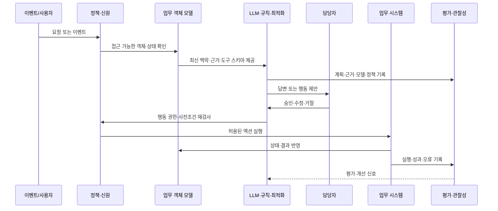
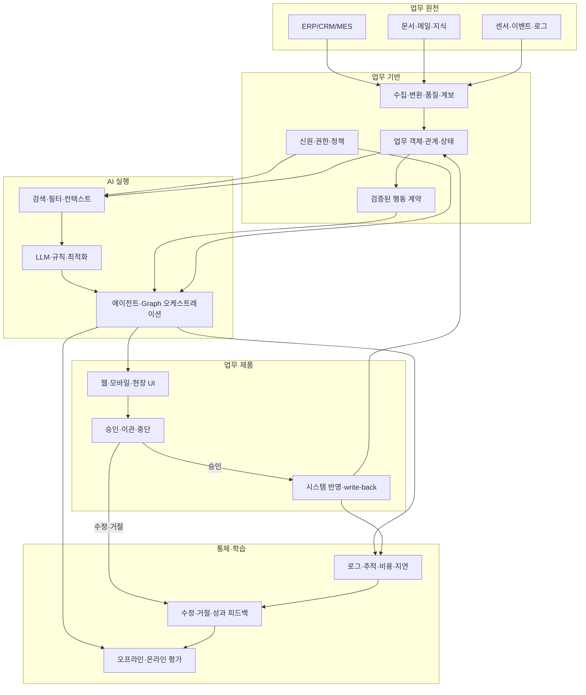

# 팔란티어 AI·기업 AX 플레이북

> 팔란티어가 공개한 제품 구조와 고객 사례를 학습 재료로 삼아, 기업이 AI를 실제 운영·의사결정·행동에 연결하는 방법을 정리한 문서입니다.

- 문서 버전: 1.0
- 자료 확인 기준일: 2026-08-14
- 근거 범위: Palantir 공식 문서·공식 고객 사례·공시, NIST AI RMF
- 핵심 독자: AX/DT 책임자, 제품·기획자, 데이터·AI 엔지니어, 보안·감사 담당자

## 1. 먼저 결론: 팔란티어에서 배워야 할 것은 모델이 아니라 운영 시스템이다

팔란티어의 공개 자료를 관통하는 핵심은 “좋은 LLM을 선택하면 업무가 자동화된다”가 아닙니다. 업무 데이터와 현장의 의미를 하나의 운영 모델로 연결하고, 그 모델 위에서 AI가 **조회하고, 추론하고, 추천하고, 승인된 행동을 실행하고, 결과를 다시 기록**하도록 만드는 데 초점이 있습니다.

팔란티어 공식 아키텍처는 Foundry를 데이터 운영 기반, AIP를 생성형 AI·에이전트·LLM을 업무에 연결하는 계층, Apollo를 다양한 환경에 소프트웨어를 지속 배포하는 계층으로 설명합니다. Ontology는 데이터 테이블의 대체 이름이 아니라 사람·업무·자산·거래·상태·행동을 연결하는 운영 모델로 제시됩니다. 이 조합을 기업 AX 관점에서 번역하면 다음과 같습니다.

> **업무의 의미를 먼저 통합하고 → AI의 맥락과 도구를 제한하고 → 사람의 승인 가능한 행동으로 연결하고 → 평가·감사·피드백을 제품의 일부로 운영한다.**

이것이 이 저장소가 제안하는 AX의 기본 방정식입니다.

```text
AX 성과 = 업무 문제의 선명도
        × 데이터·업무 객체의 연결성
        × 행동 계약의 안전성
        × 현업 채택률
        × 지속적인 평가·운영 능력
```

곱셈으로 표현한 이유는 한 항이 0에 가까우면 전체 가치도 급격히 떨어지기 때문입니다. 모델이 아무리 좋아도 업무 기준선이 없거나, 시스템에 결과를 반영할 수 없거나, 현업이 사용하지 않으면 AX 성과라고 부르기 어렵습니다.

## 2. 범위와 사실의 경계

### 2.1 “팔란티어가 회사에서 AI를 어떻게 사용하는가”의 의미

공개 자료만으로 팔란티어 내부의 모든 사내 AI 사용 방식이나 내부 의사결정 과정을 확인할 수는 없습니다. 이 문서에서 말하는 팔란티어의 사용 방식은 다음을 뜻합니다.

1. 팔란티어가 기업 고객에게 공개한 제품·플랫폼 구조
2. 팔란티어가 공개한 기업 고객의 업무 적용 사례
3. 팔란티어가 설명하는 AI 개발·배포·거버넌스 방식

따라서 “팔란티어 내부가 반드시 이렇게 운영된다”가 아니라, “팔란티어가 기업 AI 운영에 대해 공개적으로 제시하는 설계 패턴”으로 읽어야 합니다.

### 2.2 자료를 해석하는 세 가지 주의점

- 제품 문서는 기능의 존재와 설계 의도를 보여주지만, 모든 고객 환경에서 동일한 결과가 난다는 뜻은 아닙니다.
- 고객 사례의 비용 절감·처리 시간·자동화 비율은 원 출처가 팔란티어 또는 고객이므로, 독립적인 제3자 감사 수치와 구분해야 합니다.
- 이 문서의 AX 로드맵·평가 임계값·조직 구성은 공개 자료를 기반으로 한 분석·권고이며, 특정 회사의 법률·보안·노동·규제 검토를 대체하지 않습니다.

## 3. 팔란티어 공개 플랫폼 구조를 AX 관점에서 해석하기

### 3.1 전체 구조

| 계층 | 팔란티어 공개 개념 | 기업 AX에서의 역할 | 도입 시 확인할 질문 |
|---|---|---|---|
| 운영 데이터 | Foundry Data Operations | 여러 시스템의 데이터 통합·변환·계보·품질 관리 | 원천 데이터와 최신 상태를 설명할 수 있는가? |
| 업무 의미 | Ontology | 고객·주문·설비·작업·계약·위험 같은 객체와 관계·상태·행동 표현 | 서로 다른 시스템의 같은 업무 대상을 하나로 볼 수 있는가? |
| AI 연결 | AIP | LLM, 검색, 함수, 에이전트, 보안, 평가, 관찰성을 업무에 연결 | AI가 어떤 맥락과 어떤 도구를 받는가? |
| 실행 흐름 | Graph·Workflow 오케스트레이션 | 노드·엣지·상태·분기·병렬·join·checkpoint·복구를 명시 | 다음 실행 위치와 상태 전이를 재현·감사할 수 있는가? |
| 실행 | Actions·Functions·Workflow | 승인·검증·쓰기·알림·자동화를 업무 규칙과 함께 수행 | AI의 출력이 실제 시스템에 안전하게 반영되는가? |
| 배포 | Apollo | 클라우드·온프레미스·엣지 등 여러 환경에 소프트웨어를 배포·관리 | 모델과 앱의 버전을 어떻게 통제하고 되돌리는가? |
| 전달 방식 | FDE(Forward Deployed Engineering) | 현장 문제를 이해하는 엔지니어와 핵심 엔지니어가 짧은 피드백 루프로 제품화 | 현업이 설계·테스트·출시에 계속 참여하는가? |

이 표는 제품을 구매하라는 제안이 아니라, AX를 “모델 프로젝트”가 아니라 **데이터·업무 모델·행동·배포·채택을 함께 만드는 시스템 프로젝트**로 보게 하는 분석 프레임입니다.

### 3.2 Foundry: 데이터가 있다는 것과 업무에 쓸 수 있다는 것은 다르다

기업에는 ERP, CRM, MES, WMS, 그룹웨어, 문서, 이메일, 센서 등 많은 데이터가 있습니다. 그러나 같은 주문을 시스템마다 다른 ID와 상태로 저장하고, “지연”, “가용”, “승인 가능”의 정의도 다르면 LLM은 더 많은 데이터를 받아도 신뢰할 만한 결론을 내리기 어렵습니다.

AX에서 데이터 기반이 해야 할 일은 단순 적재가 아닙니다.

- 원천·변환·소유자·갱신 주기를 추적한다.
- 중요한 업무 필드의 정의와 품질 규칙을 명시한다.
- 어느 시점의 데이터로 답했는지 재현할 수 있게 한다.
- 민감도·접근권한·보존기간을 데이터와 업무 객체에 연결한다.
- AI가 읽는 데이터와 결과를 쓰는 시스템의 계약을 분리한다.

### 3.3 Ontology: 테이블 중심에서 업무 객체 중심으로 이동하기

팔란티어 공식 문서는 Ontology를 실제 세계의 객체·속성·링크·행동·함수로 구성된 운영 계층으로 설명합니다. 예를 들어 공급망 업무는 단순히 `orders` 테이블을 조회하는 것이 아니라 다음과 같이 모델링할 수 있습니다.

```text
Supplier ──supplies──> Material ──used_in──> ProductionOrder
    │                       │                     │
 risk_score             available_qty        due_date / status
    │                       │                     │
    └──────[평가]──────> AllocationDecision ──[승인]──> PurchaseOrder
```

이렇게 보면 AI의 질문도 바뀝니다.

- “이번 달 주문 테이블을 요약해줘”
- “납기 위험이 높은 생산 주문을 찾아서, 원인이 공급업체 지연인지 재고 부족인지 설명해줘”
- “대체 공급업체와 비용·납기 영향을 비교해줘”
- “승인 가능한 구매주문 초안을 만들고, 승인 전에는 원장에 쓰지 마”

마지막 두 질문은 생성 텍스트만으로 끝나지 않습니다. 객체의 현재 상태, 규칙, 권한, 행동 계약, 승인 결과가 연결되어야 합니다.

### 3.4 AIP: LLM을 업무의 맥락·도구·거버넌스에 연결하기

팔란티어 공식 문서에서 AIP는 보안이 적용된 LLM 연결, 컨텍스트 엔지니어링, Ontology, 도구·함수·벡터·컴퓨트 서비스, 에이전트 생명주기, 운영 자동화, 평가·관찰성 등을 포괄하는 계층으로 설명됩니다.

기업이 여기서 배워야 할 설계는 다음과 같습니다.

1. **모델을 먼저 고르지 말고 작업 계약을 먼저 정의한다.** 입력·출력·금지 행동·근거·성공 기준이 우선입니다.
2. **프롬프트만으로 통제하지 않는다.** 접근권한, 도구 스키마, 서버측 검증, 승인 단계가 함께 있어야 합니다.
3. **읽기와 쓰기를 분리한다.** 검색·요약·분류는 읽기 단계, 상태 변경·발주·환불·권한 변경은 별도 행동 단계로 둡니다.
4. **모델 버전보다 업무 결과를 비교한다.** 동일 테스트 케이스에서 근거성·행동 정확성·거절 품질·비용·지연을 함께 비교합니다.

### 3.5 Agents와 Chatbot: 이름보다 권한과 도구가 중요하다

팔란티어 문서에는 현재 AIP Chatbot Studio가 기업별 정보·도구를 활용한 챗봇을 만들고, Foundry pro-code Agents가 LLM의 추론과 도구 호출을 포함한 사용자 정의 로직을 작성하는 방식으로 설명됩니다. 과거 문서의 AIP Agent Studio·AIP Agents가 현재 명칭과 다를 수 있으므로 자료를 읽을 때 이름 변경을 확인해야 합니다.

핵심은 “에이전트”라는 이름이 아닙니다.

- 어떤 사용자 신원으로 실행되는가?
- 읽을 수 있는 객체와 필드는 어디까지인가?
- 호출 가능한 도구와 인자는 allowlist인가?
- 쓰기 행동은 승인·검증·idempotency를 갖는가?
- 실행 결과와 근거를 감사 로그에서 다시 볼 수 있는가?
- 실패하거나 모호할 때 중단·질문·사람 이관을 하는가?

### 3.6 Actions: 자연어를 업무 변경으로 바꾸는 안전 경계

팔란티어의 Action Types 문서는 객체·속성·링크를 변경하고, 검증·부작용·알림·권한을 포함하는 거래 단위로 액션을 설명합니다. AX 시스템에서도 AI가 직접 SQL을 생성해 운영 DB를 수정하게 하기보다 다음과 같은 행동 계약을 둬야 합니다.

```yaml
action: approve_purchase_order
subject: PurchaseOrder
preconditions:
  - status == "PENDING_APPROVAL"
  - total_amount <= approver_limit
  - supplier.is_active == true
required_permissions:
  - purchase_order:view
  - purchase_order:approve
approval: human_required
idempotency_key: purchase_order_id + version
write_effect:
  - status: "APPROVED"
  - approved_by: current_user
audit:
  - evidence_ids
  - model_version
  - policy_version
  - approval_timestamp
```

AI는 이 계약에 맞는 실행 계획을 제안할 수 있지만, 서버측 권한과 사전조건을 우회할 수 없어야 합니다.

### 3.7 Evals와 Observability: 출시 후가 아니라 개발 중부터 측정하기

팔란티어의 AIP Evals 문서는 테스트 케이스·평가 기준·평가 함수로 평가 스위트를 구성하고, 모델·버전·실행 간 결과를 비교·디버깅하는 흐름을 설명합니다. AIP Observability 문서는 실행 기록, 로그, 분산 추적, 성공·실패, P95 실행 시간, 토큰 사용량과 오류 등을 관찰 대상으로 제시합니다.

AX 프로젝트에 적용하면 다음 질문을 매 배포마다 답해야 합니다.

- 올바른 근거를 사용했는가?
- 모르면 모른다고 했는가?
- 권한이 없는 정보를 노출하지 않았는가?
- 추천한 행동의 대상·수량·조건이 맞는가?
- 같은 요청을 재시도해도 중복 실행되지 않는가?
- 사람이 승인·수정·거절한 비율은 얼마인가?
- 업무 지표가 좋아졌는가, 아니면 사용량만 늘었는가?

## 4. 팔란티어식 기업 AI 사용 패턴

### 4.1 표준 업무 루프



이 루프에서 AI가 맡는 범위는 위험도에 따라 단계적으로 넓어져야 합니다.

| 단계 | AI의 권한 | 예시 | 기본 통제 |
|---|---|---|---|
| L0 관찰 | 없음 | 데이터 품질·업무 흐름 모니터링 | 로그·대시보드 |
| L1 읽기 | 조회·요약 | “지연 주문과 근거를 보여줘” | 객체·필드 권한, 출처 표시 |
| L2 추천 | 대안·우선순위 제안 | “납기 회복 순서를 추천해줘” | 기준선 비교, 불확실성, 사람 검토 |
| L3 준비 | 실행 초안 생성 | 구매주문·고객 응답·티켓 초안 | 스키마 검증, 미리보기, 승인 필수 |
| L4 제한 실행 | 사전 허용된 저위험 액션 | 담당자 승인 후 상태 변경·알림 | allowlist, 조건, idempotency, 감사 |
| L5 자율 운영 | 제한된 범위의 반복 실행 | 저위험·가역 업무의 자동 처리 | 예산·속도·범위 한도, 중단 스위치, 정기 심사 |

대부분의 조직은 L1에서 시작해 L2~L3의 가치와 안전성을 확인한 뒤 L4로 가는 것이 현실적입니다. L5는 “에이전트가 똑똑한가”가 아니라 오류의 피해가 제한적이고, 상태를 되돌릴 수 있으며, 운영자가 지속 감시할 수 있는지로 판단해야 합니다.

### 4.2 공개 고객 사례에서 보이는 공통 흐름

다음 사례의 성과 수치는 모두 원 출처 기준이며 독립적인 제3자 검증 수치로 간주하지 않습니다.

| 분야·사례 | 공개된 적용 흐름 | AX 관점의 학습 |
|---|---|---|
| General Mills | 공급망 데이터·제약조건·생산능력·네트워크 비용을 연결하고, 주문 의사결정에 대한 추천을 사람과 함께 운영 | AI 추천보다 먼저 대규모 의사결정의 입력과 인간 승인 루프를 모델링 |
| Panasonic Energy North America | 정비 이력·센서·문서를 활용해 기술자 코파일럿을 만들고, 결과를 업무에 다시 기록 | 지식 검색과 현장 조치를 연결하고, 답변이 업무 기록으로 이어지게 설계 |
| Heineken USA | 유통·재고 데이터를 바탕으로 재고 부족·운영 알림을 우선순위화 | “알림을 더 많이”가 아니라 행동 가능한 예외와 담당자를 연결 |
| Wendy’s QSCC | 여러 매장의 주문·재고 상황을 보고 자원 재배분 의사결정을 지원 | 본사·현장·매장 단위의 객체와 권한을 동일한 운영 모델에 연결 |
| Beyond Meat | 여러 데이터 소스를 통합한 재고·공급망 가시성과 LLM 기반 요약 | 다원화된 데이터의 의미 통합이 자연어 인터페이스보다 선행 |

General Mills 사례 자료에는 공급망 규모, 사람의 추천 수용, 비용 절감 등의 구체적 수치가 기재되어 있지만, 이 문서에서는 해당 수치를 우리 조직의 기대효과로 복사하지 않습니다. 우리 조직에서는 반드시 같은 정의의 기준선과 비교군을 먼저 측정해야 합니다.

### 4.3 “챗봇”으로 보이지만 실제로는 업무 애플리케이션인 이유

기업용 AI 인터페이스가 채팅 형태여도 내부 구성은 다음과 같아야 합니다.

```text
질문
 └─ 사용자 신원·조직·역할 확인
     └─ 조회 가능한 업무 객체 선택
         └─ 구조화 데이터 + 문서 + 최신 이벤트 결합
             └─ LLM/규칙/최적화로 답변 또는 계획 생성
                 └─ 근거·불확실성·예상 영향 표시
                     └─ 승인 가능한 행동으로 변환
                         └─ 업무 시스템 반영 + 감사 기록
```

채팅창만 만들고 이 연결을 생략하면 데모는 되지만, 업무 프로세스와 성과 지표를 가진 제품은 되기 어렵습니다.

## 5. 기업 AX 도입 원칙

### 원칙 1. “AI를 도입하자”가 아니라 업무 병목을 한 문장으로 정의한다

좋은 출발점은 모델명이나 기술 유행이 아니라 다음 형식입니다.

> 특정 역할이 특정 업무 객체를 처리할 때, 현재 어떤 판단·입력·대기·재작업 때문에 어떤 손실이 발생하고 있으며, AI가 어느 구간의 시간을 줄이거나 품질을 높일 것인가?

예시:

- 나쁜 목표: “구매팀에 생성형 AI 챗봇을 도입한다.”
- 좋은 목표: “구매 담당자가 공급 지연 주문을 매일 수작업으로 찾고 대체안을 비교하는 90분을 줄이되, 승인 없는 발주 변경은 허용하지 않는다.”

### 원칙 2. 유스케이스보다 먼저 업무 객체와 상태를 그린다

파일럿 대상 업무의 핵심 객체를 5~10개로 제한해 시작합니다.

| 질문 | 예시 |
|---|---|
| 무엇을 다루는가? | 주문, 공급업체, 자재, 생산계획 |
| 상태는 무엇인가? | 대기, 승인, 지연, 취소, 완료 |
| 누가 소유하는가? | 구매 담당자, 생산 관리자 |
| 어떤 근거가 필요한가? | ERP, 계약서, 센서, 이메일 |
| AI가 할 수 있는 행동은? | 조회, 우선순위화, 초안, 승인 요청 |
| 행동의 피해는? | 비용, 납기, 안전, 개인정보, 규제 |

객체·상태·행동이 정의되지 않은 상태에서 RAG부터 시작하면 검색은 되지만 의사결정은 재현되지 않습니다.

### 원칙 3. 데이터 계약과 행동 계약을 분리해 만든다

데이터 계약은 “무엇을 읽는가”를, 행동 계약은 “무엇을 바꿀 수 있는가”를 정의합니다.

```text
데이터 계약
  source / owner / freshness / schema / lineage / sensitivity / access

행동 계약
  actor / target / precondition / permission / side effect
  approval / idempotency / rollback / audit / timeout
```

특히 AI 출력이 자유 텍스트 하나뿐이면 downstream 시스템이 이를 해석하는 순간 안전 경계가 사라집니다. 행동은 구조화된 명령 객체로 만들고, 서버가 다시 검증해야 합니다.

### 원칙 4. 모델을 하나로 고정하지 말고 작업 유형에 맞춰 조합한다

업무 전체를 LLM에게 맡길 필요는 없습니다.

- 정확한 합계·기간·상태: SQL·규칙·계산기
- 유사 문서·정비 기록 찾기: 검색·임베딩·필터
- 대안 조합·자원 배분: 최적화·시뮬레이션
- 자연어 설명·질문 의도 파악: LLM
- 정책 위반·필수값 누락 확인: 결정론적 검증기

LLM은 설명과 불완전한 언어 입력 처리에 강하지만, 모든 계산·권한·정책 집행의 단일 소스로 두면 안 됩니다.

### 원칙 5. 처음부터 사람이 개입하는 지점을 설계한다

사람을 제거하는 것이 AX의 자동 목표가 아닙니다. 사람이 가장 가치 있는 판단을 하고, 반복 탐색·전처리·기록을 AI가 줄이는 것이 현실적인 출발점입니다.

사람 개입 설계에는 다음이 포함됩니다.

- 승인자와 대체 승인자
- AI가 제안한 근거·불확실성·영향
- 수정·거절 사유
- 일정 시간 무응답 시 중단 또는 이관
- 긴급 중지·롤백 절차
- AI가 내린 결정인지 사람이 최종 결정했는지의 기록

### 원칙 6. 평가 케이스를 운영 시나리오에서 만든다

개발자가 만든 쉬운 질문만으로 평가하지 않습니다. 현업의 실제 케이스를 다음 범주로 나눕니다.

1. 정상: 최신 데이터로 자주 발생하는 업무
2. 경계: 일부 필드 누락, 오래된 데이터, 복수 해석
3. 권한: 다른 조직·고객·민감 필드 접근 시도
4. 적대적: 프롬프트 인젝션, 비정상 입력, 도구 인자 조작
5. 실패: 외부 시스템 장애, 타임아웃, 중복 요청, 승인 거절
6. 회귀: 모델·프롬프트·데이터·정책 버전 변경 후 기존 기능

### 원칙 7. “정확도”와 “업무 가치”를 분리한다

AI 답변이 정답에 가까워도 업무 시간이 줄지 않거나, 추천을 아무도 신뢰하지 않으면 제품 성과는 낮습니다. 반대로 완벽하지 않아도 검토 시간을 크게 줄이고 위험한 행동을 잘 거절하면 가치가 있을 수 있습니다.

최소 지표 묶음은 다음과 같습니다.

```text
품질: 근거성·필드 정확성·행동 정확성·거절 품질
안전: 권한 누출 0건·위험 행동 차단율·감사 완전성
운영: 성공률·P95 지연·비용/작업·장애 복구 시간
채택: 활성 사용자·반복 사용·수정/거절 이유·승인 소요 시간
사업: 처리 시간·재작업·오류·재고·매출·비용·고객/직원 경험
```

## 6. 90일 AX 파일럿 실행 계획

아래 계획은 “모든 데이터를 통합하는 대형 플랫폼 구축”이 아니라, 한 업무의 읽기→추천→승인된 행동까지를 검증하는 기준선입니다.

### 0~2주: 문제·기준선·위험도 확정

산출물:

- 한 문장 문제 정의
- 현재 처리 시간·대기 시간·오류·재작업 기준선
- 대상 사용자 3~10명과 실제 업무 시나리오
- 객체·상태·근거 시스템 초안
- 대표 실행 trace와 그래프 후보 노드·분기·승인·복구 지점
- 위험 분류: 읽기 / 추천 / 준비 / 제한 실행
- 파일럿을 중단할 조건

통과 질문:

- AI가 없어도 현재 업무의 성공 여부를 측정할 수 있는가?
- 최소 한 명의 현업 소유자가 주 1회 이상 테스트할 수 있는가?
- 처리 데이터의 권한·민감도 검토가 되었는가?

### 3~4주: 데이터·업무 객체·권한 계약

산출물:

- 원천·변환·갱신주기·소유자 표
- 핵심 객체와 상태 전이 정의
- graph version·checkpoint·resume·retry·escalation 계약 초안
- 조회 API/검색 인덱스/문서 필터 설계
- 역할별 객체·필드 권한 매트릭스
- 행동 계약 초안과 감사 이벤트 스키마

통과 질문:

- AI가 사용한 값의 출처와 기준 시각을 표시할 수 있는가?
- 접근권한이 없는 사용자가 프롬프트를 바꿔도 데이터를 얻지 못하는가?
- 같은 행동을 두 번 요청했을 때 중복 반영되지 않는가?

### 5~6주: 읽기 전용 코파일럿

범위:

- 업무 객체 검색·필터·요약
- 조회·검증·합성만 포함한 read-only 실행 그래프와 node/edge trace
- 답변마다 출처 객체·문서·기준 시각 표시
- 모호한 요청에 추가 질문
- 데이터가 없거나 오래되었을 때 명시적 중단

금지:

- 운영 시스템 쓰기
- 그래프의 write/action 노드 실행
- 승인 없이 외부 메시지 발송
- 권한 우회용 관리자 검색

측정:

- 질문별 근거성·필드 정확성
- 기존 수작업 대비 탐색 시간
- 현업 수정률과 “모름” 응답의 적절성

### 7~8주: 추천·오프라인 평가

범위:

- 현업이 이미 내리는 우선순위·분류·대안 비교를 추천
- 실제 과거 케이스를 고정한 평가 세트 구성
- 사람의 정답·허용 가능한 대안·금지 조건을 기록
- 모델·프롬프트·검색 전략을 동일 케이스로 비교

통과 기준은 업무에 따라 달라야 하지만, 최소한 다음은 명시해야 합니다.

- 치명적 권한 누출: 0
- 필수 근거 누락: 0에 가깝게 관리하고 발생 시 출시 중단
- 위험 행동 제안: 정책상 허용된 범위만
- 불확실한 케이스의 보수적 거절 또는 사람 이관
- 기준선 대비 처리 시간·재작업의 측정 가능한 변화

### 9~10주: 사람 승인과 제한된 write-back

처음 쓰기 기능은 가역적이고 영향이 작은 행동으로 제한합니다.

좋은 첫 행동 예시:

- 티켓에 근거 링크와 요약을 초안으로 저장
- 담당자에게 승인 요청 생성
- 객체의 “검토 필요” 태그 변경
- 이미 승인된 템플릿으로 내부 알림 생성

피해야 할 첫 행동 예시:

- 대량 발주·환불·가격 변경
- 인사·권한·보안 정책 변경
- 고객·규제기관에 자동 외부 발송
- 되돌릴 수 없는 데이터 삭제

### 11~12주: 파일럿 결과와 확장 결정

세 그룹을 비교합니다.

1. 기존 방식으로 처리한 기준선 그룹
2. AI 추천을 보되 사람이 최종 처리한 그룹
3. 승인된 제한 행동까지 사용한 그룹

비교해야 할 것은 단순 사용량이 아닙니다.

- 총 처리 시간과 대기 시간
- 최초 결과까지 걸린 시간
- 수정·재작업·오류
- 사람의 승인·거절·수정 비율
- 위험 행동 차단과 권한 위반
- 사용자별 편차와 신규 사용자 학습 시간
- 사용량당 비용과 장애 복구 가능성

확장 결정:

- **확장**: 품질·안전·업무 성과가 모두 기준을 통과하고, 소유자와 운영 예산이 있음
- **제한 유지**: 품질은 유망하지만 데이터·권한·채택 문제가 남음
- **중단·재설계**: 기준선 대비 가치가 없거나, 권한·감사·행동 안전 문제가 해결되지 않음

## 7. 기술 참조 아키텍처

### 7.1 권장 논리 구성



여기서 오케스트레이션을 하나의 에이전트 호출로 뭉뚱그리지 않는다. 업무가 복잡해지는 경우 [AX 그래프 엔지니어링 플레이북](GRAPH-ENGINEERING-PLAYBOOK.md)의 `Harness → Loop → Graph` 경계를 적용해, 먼저 실제 실행 trace를 관찰하고 안정적인 경로만 노드·엣지·상태 전이로 고정한다. 그래프는 Ontology/지식 그래프와 다른 실행·제어 그래프이며, read-only graph가 재현되기 전에는 업무 write-back으로 승격하지 않는다.

### 7.2 요청 처리 계약

모든 요청은 아래 필드를 남기는 것을 권장합니다.

```json
{
  "request_id": "stable-request-id",
  "actor": "user-or-service-identity",
  "use_case": "supply_delay_triage",
  "input_object_ids": ["order-123", "supplier-77"],
  "data_as_of": "2026-08-14T09:00:00+09:00",
  "policy_version": "policy-2026-08-01",
  "model_version": "model-release-id",
  "retrieved_evidence_ids": ["erp:order-123", "doc:contract-77"],
  "proposed_action": {
    "type": "create_review_task",
    "arguments": {"assignee": "buyer-team"}
  },
  "approval": {
    "required": true,
    "approved_by": null
  },
  "result": "pending_review"
}
```

실제 구현에서는 사용자·서비스 식별자와 민감한 입력을 로그에 그대로 남기지 말고, 조직의 보존·마스킹 정책을 적용해야 합니다. 위 예시는 계약의 필드만 보여주는 학습용 형식입니다.

### 7.3 실패를 정상 경로로 설계하기

| 실패 상황 | AI가 해야 할 일 | 시스템이 해야 할 일 |
|---|---|---|
| 데이터가 오래됨 | 기준 시각과 불확실성 표시 | freshness 정책에 따라 차단 또는 경고 |
| 권한 부족 | 접근 거부를 설명하되 숨겨진 값은 암시하지 않음 | 서버에서 조회 자체를 차단하고 감사 |
| 필수 필드 누락 | 추가 질문 또는 사람 이관 | 불완전한 행동 계약 실행 금지 |
| 도구 오류 | 재시도 한도 후 중단 | 부분 성공·중복 여부를 기록 |
| 승인 거절 | 이유를 보존하고 대안·이관 제공 | 상태를 원래 값으로 유지 |
| 모델 불확실 | 추측 대신 모름·근거 부족 표시 | 고위험 경로 자동 실행 금지 |
| 프롬프트 인젝션 | 지시와 데이터의 경계를 유지 | 도구 권한과 서버 검증으로 최종 차단 |
| 중복 요청 | 동일 idempotency 키로 기존 결과 반환 | 중복 write 방지 |

## 8. 보안·거버넌스: AI가 강해질수록 통제도 제품 기능이 된다

팔란티어의 AI FDE 보안 문서는 사용자 신원과 권한에 따라 AI가 실행되고, 별도 관리자 권한을 자동으로 얻지 않으며, 변이 행동에는 사용자 승인이 필요하다는 방향을 설명합니다. NIST AI RMF는 이를 조직 전체 위험관리 관점에서 Govern·Map·Measure·Manage 네 기능으로 다룹니다.

### 8.1 Govern — 책임과 정책

- 유스케이스별 비즈니스 소유자·기술 소유자·위험 소유자를 지정한다.
- 허용·금지·승인필요 행동을 정책으로 문서화한다.
- 모델·데이터·프롬프트·도구·정책 버전의 변경 책임을 정한다.
- 사고 보고·중단·복구·감사 요청 절차를 만든다.
- 공급업체·오픈소스·외부 모델의 데이터 보존과 재학습 조건을 확인한다.

### 8.2 Map — 맥락과 위험

- 사용 대상과 영향을 받는 사람을 정의한다.
- 개인정보·영업비밀·안전·재무·고객 권리를 분류한다.
- 오류가 날 때 누구에게 어떤 피해가 생기는지 작성한다.
- 사람의 현재 판단과 AI의 제안이 어떻게 결합되는지 흐름으로 그린다.
- 데이터 출처·대표성·최신성·편향 가능성을 기록한다.

### 8.3 Measure — 측정과 증거

- 실제 업무 케이스로 평가 세트를 고정한다.
- 근거성·정확성·거절·권한·행동·지연·비용을 분리 측정한다.
- 배포 전 오프라인 평가와 배포 후 온라인 모니터링을 연결한다.
- 사용자 수정·거절을 오류 라벨로 축적한다.
- 모델 교체 전후의 회귀 결과와 승인 기록을 남긴다.

### 8.4 Manage — 완화와 지속 개선

- 위험 수준에 따라 읽기·추천·준비·실행 권한을 단계화한다.
- 고위험 행동에는 사람 승인·이중 확인·금액·건수·시간 한도를 둔다.
- 실패 시 자동 중단·수동 전환·롤백 경로를 운영한다.
- 출시 후 새 데이터 분포·정책 변경·모델 성능 저하를 감시한다.
- 위험이 기준을 넘으면 기능을 줄이거나 중단할 수 있게 한다.

### 8.5 최소 보안 체크리스트

- [ ] 시스템 권한이 아니라 요청 사용자 권한으로 조회·행동을 평가한다.
- [ ] 검색 인덱스와 캐시에도 원천 데이터 권한이 적용된다.
- [ ] LLM에게 전달되는 필드가 업무에 필요한 최소 범위다.
- [ ] 도구와 행동은 allowlist·타입·사전조건을 가진다.
- [ ] 모든 쓰기 행동에 승인·감사·idempotency가 있다.
- [ ] 모델이 생성한 SQL·코드·URL·명령은 실행 전에 서버 검증을 거친다.
- [ ] 외부 전송·대량 처리·고위험 결정은 별도 게이트가 있다.
- [ ] 로그에 원문 비밀값·불필요한 개인정보가 남지 않는다.
- [ ] 모델·프롬프트·검색·정책·데이터 버전을 재현할 수 있다.
- [ ] 운영자가 중단하고 이전 버전으로 되돌릴 수 있다.

## 9. 조직과 개발 방식

### 9.1 FDE에서 배울 점: 현장 가까이에서 짧은 루프를 만든다

팔란티어가 공개한 FDE 방식은 엔지니어가 문제 현장 가까이에서 고객·현업과 일하고, 핵심 엔지니어링 조직과 피드백을 주고받으며 기능을 제품화하는 방식으로 설명됩니다. 이를 그대로 복제할 필요는 없지만, AX 조직은 다음을 채택할 수 있습니다.

- 개발자를 현업 인터뷰와 운영 관찰에서 분리하지 않는다.
- 현업이 제공한 사례를 평가 케이스로 바로 전환한다.
- 한 번에 여러 부서를 자동화하기보다 하나의 흐름을 끝까지 연결한다.
- 임시 스크립트도 폐기하지 말고, 반복 가치가 확인되면 플랫폼 기능으로 승격한다.
- 현업의 수정·거절을 비난이 아니라 제품 요구사항으로 기록한다.

### 9.2 권장 파일럿 스쿼드

| 역할 | 책임 |
|---|---|
| Executive sponsor | 조직 간 우선순위·예산·장애물 제거 |
| Product/AX owner | 문제 정의·성과 지표·범위·출시 결정 |
| Domain SME | 실제 업무 규칙·예외·정답·승인 흐름 제공 |
| Data engineer | 원천·품질·계보·신선도·접근 계약 |
| AI/LLM engineer | 검색·프롬프트·모델·도구·평가 파이프라인 |
| Application engineer | UI·API·상태·write-back·idempotency |
| Platform/SRE | 배포·관찰성·비용·장애복구·롤백 |
| Security/legal/risk | 개인정보·권한·감사·규제·공급업체 검토 |
| Adoption/change lead | 교육·사용자 피드백·업무 절차·채택 측정 |

작은 회사는 한 사람이 여러 역할을 맡을 수 있지만, 책임 자체를 없애면 안 됩니다.

### 9.3 개발 생명주기

```text
Discover → Model → Ground → Evaluate → Approve → Deploy → Observe → Improve
   │          │         │          │          │          │          │
문제·기준선  객체·권한  근거·도구  테스트·임계값  출시판정  제한운영  지표·피드백
```

각 단계가 끝날 때 문서 한 장 또는 자동화된 증거를 남깁니다. “데모가 된다”는 Evaluate·Approve·Observe를 통과한 것이 아닙니다.

## 10. 자주 실패하는 접근과 교정

| 실패 패턴 | 왜 실패하는가 | 교정 |
|---|---|---|
| 전사 챗봇부터 출시 | 문제·사용자·업무 성과가 분산됨 | 한 업무 객체와 한 병목으로 시작 |
| 모델 정확도만 경쟁 | 답변이 시스템 변경·채택으로 이어지지 않음 | 품질·안전·운영·사업 지표를 함께 정의 |
| RAG만 붙이고 끝냄 | 검색된 문장이 상태·권한·행동과 연결되지 않음 | 객체 모델·출처·행동 계약을 추가 |
| AI가 DB를 직접 수정 | 권한·정책·중복·롤백 경계가 무너짐 | 타입이 있는 allowlisted action과 서버 검증 |
| POC 수치로 전사 ROI 주장 | 표본·기준선·비교군이 없음 | 파일럿에서 기준선·반사실·운영 지표 측정 |
| 사람을 승인 버튼으로만 취급 | 현업의 맥락과 책임이 시스템 밖으로 빠짐 | 근거·영향·수정·거절 사유를 제품에 포함 |
| 모든 업무를 하나의 에이전트에 위임 | 권한·도구·실패 범위가 과도하게 커짐 | 작은 전문 도구·작업별 권한·오케스트레이션 |
| 로그를 나중에 추가 | 실패 재현·감사·원인 분석이 불가능 | 요청부터 모델·근거·행동·결과를 구조화 기록 |
| 배포가 마지막 단계 | 데이터·권한·운영 비용이 뒤늦게 발목을 잡음 | 초기부터 실제 배포·관찰성·롤백 경로를 검증 |

## 11. 경영진이 확인할 의사결정 게이트

### Gate A — 시작할 가치가 있는가?

- 문제의 현재 비용과 책임자가 있는가?
- 90일 안에 결과를 관찰할 수 있는가?
- 데이터·권한·시스템 연결이 현실적인가?
- 실패의 피해가 제한 가능한가?

### Gate B — AI 추천을 믿을 수 있는가?

- 실제 케이스 평가에서 근거와 행동 추천이 기준을 넘는가?
- 잘 모르는 케이스를 보수적으로 처리하는가?
- 권한 위반·프롬프트 인젝션·오래된 데이터 테스트를 통과했는가?
- 현업의 수정·거절 이유가 해결되었는가?

### Gate C — 업무에 반영해도 되는가?

- 행동 계약·승인·idempotency·롤백이 있는가?
- 변경 대상 시스템과 감사 로그를 독립적으로 확인했는가?
- 운영 담당자가 장애·중단·복구를 연습했는가?
- 외부 발송·재무·안전·개인정보 영향 검토가 끝났는가?

### Gate D — 확장할 가치가 있는가?

- 기준선보다 처리 시간·오류·재작업·비용이 좋아졌는가?
- 특정 한 명의 영웅적 사용이 아니라 반복 사용되는가?
- 유지보수·모델 사용료·데이터 품질 비용을 감당할 수 있는가?
- 다음 부서로 확장해도 객체·권한·운영 모델이 재사용되는가?

## 12. AI Study 학습 순서와 실습

### 12.1 30초 설명

“팔란티어식 기업 AI의 핵심은 LLM을 업무 데이터에 붙이는 것이 아니라, 업무 객체·상태·권한·행동을 운영 모델로 묶고 AI를 그 위의 조회·추천·실행 인터페이스로 두는 것입니다. 그래서 파일럿도 챗봇 데모가 아니라, 기준선이 있는 실제 업무 루프와 사람 승인·평가·감사까지 검증해야 합니다.”

### 12.2 2분 설명 구조

1. 문제: 어떤 업무 병목을 줄이는가?
2. 기반: 어떤 객체·상태·데이터·권한을 통합하는가?
3. 지능: LLM·검색·규칙·최적화를 어떤 역할로 나누는가?
4. 행동: AI가 제안하거나 실행할 수 있는 계약은 무엇인가?
5. 통제: 사람 승인·정책·감사·롤백은 어디에 있는가?
6. 검증: 품질·안전·운영·사업 지표의 기준은 무엇인가?

### 12.3 개인 또는 팀 실습 3개

#### 실습 1 — 업무 객체 지도

자신의 조직에서 “지연”이 중요한 업무 하나를 선택하고 객체·속성·관계·상태·소유자·행동을 한 장에 그립니다. 테이블 이름을 나열하는 데서 끝내지 말고, 사람이 실제로 어떤 결정을 내리는지 적습니다.

#### 실습 2 — 읽기에서 행동까지 계약 만들기

`조회 → 추천 → 초안 → 승인 → write-back`의 각 단계에 입력·출력·권한·실패·감사 필드를 작성합니다. AI가 직접 바꿀 수 없는 상태를 명시합니다.

#### 실습 3 — 평가 세트 만들기

실제 업무 사례 30개를 익명화해 정상 15개, 경계 5개, 권한 5개, 실패·적대적 5개로 나누고, 정답·허용 가능한 대안·금지 행동·근거를 기록합니다. 모델을 바꿔도 같은 세트로 비교합니다.

### 12.4 스터디 질문

- Ontology가 단순 데이터 카탈로그와 다른 점은 무엇인가?
- 왜 AI의 행동을 구조화된 Action으로 제한해야 하는가?
- 인간 승인 단계를 없애는 것이 아니라 재설계해야 하는 이유는 무엇인가?
- 추천의 정확도와 실제 채택률이 다를 때 어떤 원인을 조사할 것인가?
- 데이터 최신성·권한·감사를 LLM 프롬프트만으로 해결할 수 없는 이유는 무엇인가?
- 우리 조직에서 L1 읽기 전용으로 시작하기 좋은 업무는 무엇인가?

## 13. 최종 체크리스트

### 문제·가치

- [ ] 한 문장 문제 정의와 현재 기준선이 있다.
- [ ] 업무 소유자와 최종 의사결정자가 정해졌다.
- [ ] 성공·중단·확장 조건이 수치 또는 관찰 가능한 사건으로 정의됐다.

### 데이터·업무 모델

- [ ] 핵심 객체·관계·상태·소유자가 정의됐다.
- [ ] 데이터 출처·신선도·품질·계보를 설명할 수 있다.
- [ ] 검색·캐시·문서에도 권한이 적용된다.

### AI·행동

- [ ] LLM과 결정론적 계산·검증의 역할이 분리됐다.
- [ ] 답변은 근거와 기준 시각을 보여준다.
- [ ] 행동은 타입·사전조건·권한·승인·idempotency를 가진다.
- [ ] 모호함·데이터 부족·도구 오류 시 중단·질문·이관한다.

### 평가·운영

- [ ] 정상·경계·권한·적대적·실패·회귀 케이스가 있다.
- [ ] 모델·프롬프트·검색·정책·데이터 버전을 재현할 수 있다.
- [ ] 지연·비용·오류·권한 위반·사용자 수정이 관찰된다.
- [ ] 롤백·중단·장애복구를 실제로 연습했다.

### 사람·조직

- [ ] 현업 SME가 평가와 출시 결정에 참여한다.
- [ ] 사용자 교육과 업무 절차 변경이 준비됐다.
- [ ] 수정·거절 사유가 다음 개선 작업으로 연결된다.

## 14. 맺음말

팔란티어 공개 자료가 기업 AX에 주는 가장 큰 교훈은 “AI를 더 많이 넣자”가 아닙니다. **업무를 운영 가능한 객체와 행동의 그래프로 다시 보고, AI를 그 그래프를 안전하게 탐색하고 움직이는 협업자처럼 배치하자**는 것입니다.

우리 조직이 팔란티어의 모든 제품이나 방법론을 도입할 필요는 없습니다. 대신 다음 세 가지는 어떤 기술 스택에서도 재사용할 수 있습니다.

1. 업무 의미와 데이터 출처를 통합한다.
2. AI의 행동을 권한·검증·승인·감사 가능한 계약으로 제한한다.
3. 작은 실제 업무 루프를 평가·관찰·피드백과 함께 배포한다.

이 세 가지가 갖춰졌을 때 모델 교체, 검색 방식 변경, 클라우드·온프레미스·엣지 배포, 여러 업무로의 확장이 기술 실험이 아니라 관리 가능한 제품 개발이 됩니다.

---

다음 문서: [AX 전환 가이드](AX-TRANSFORMATION-GUIDE.md) · [AX 기술 파이프라인·시스템 설계](AX-TECHNICAL-PIPELINE.md) · [AX 성숙도 평가](AX-MATURITY-ASSESSMENT.md) · [AX 프로그램 캔버스](AX-PROGRAM-CANVAS.md) · [AX 유스케이스 캔버스](AX-USE-CASE-CANVAS.md) · [평가 루브릭](EVALUATION-RUBRIC.md) · [참고자료](REFERENCES.md)

